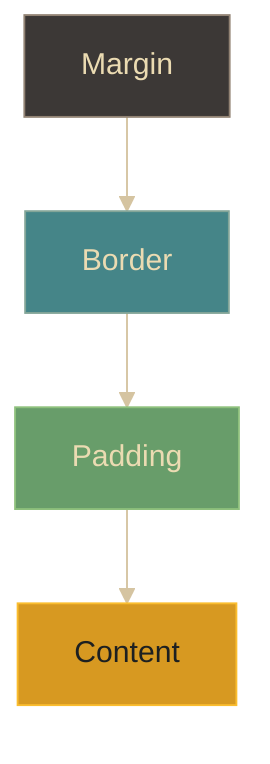

# CSS - Box Model

## Definición
Todos los elementos HTML se representan como cajas rectangulares que consisten en márgenes, bordes, relleno y el contenido real. El modelo de caja (box model) define cómo se calculan las dimensiones y el espacio alrededor de estos elementos.

## Explicación
- *Qué problema resuelve*
    Principalmente, el box model resuelve cómo medir y espaciar los elementos en una página web, asegurando que se vean y funcionen correctamente en diferentes dispositivos y tamaños de pantalla.
- *Cómo funciona por arriba*
    Cada caja tiene cuatro áreas: contenido (content), relleno (padding), borde (border) y margen (margin). El tamaño total de un elemento se calcula sumando el ancho/alto del contenido, el relleno, el borde y el margen.
- *Qué implica / qué permite*
    Permite a los desarrolladores controlar el espacio y la disposición de los elementos en una página web, facilitando el diseño y la estética del sitio.

## Capas del box model (idea)

## Palabras clave
- Contenido (Content)
- Relleno (Padding)
- Borde (Border)
- Margen (Margin)

## Comparaciones típicas
- vs [[08 - CSS - Propiedades comunes]]: el box model explica cómo se calcula el tamaño/espacio; las propiedades son las herramientas para ajustarlo.
- vs [[10 - CSS - Diseño responsivo]]: el box model define medidas/espaciado; el responsivo decide cómo adaptarlos según el viewport.

## Preguntas de examen
- ¿Qué es el box model en CSS?
- ¿Para qué sirve el box model?
- ¿Cuál es la diferencia entre padding y margin?
- ¿Qué pasa si cambias el valor del borde en un elemento?

## Errores comunes
- Confundir padding con margin.
- No considerar el borde al calcular el tamaño total de un elemento.
- Olvidar que el box model afecta el diseño y la disposición de los elementos en la página.

## Mini-ejemplo (mental)
- Es como si tuvieras una caja de regalo (contenido) dentro de otra caja (padding), con un lazo alrededor (borde) y espacio extra alrededor de la caja (margen). Cada parte afecta el tamaño total de la caja que ves.
