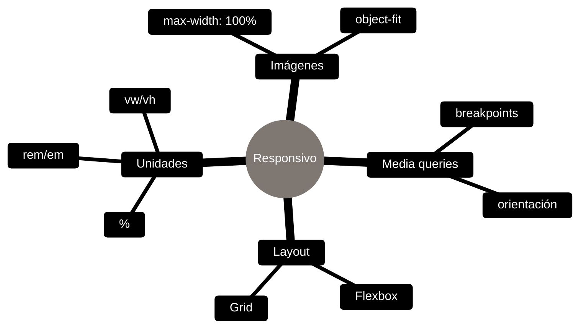

# CSS - Diseño responsivo

## Definición
Es una técnica que permite que las páginas web se adapten a los diferentes tamaños y resoluciones de diferentes dispositivos, como computadoras de escritorio, tabletas y teléfonos móviles, haciendo que el contenido sea legible y accesible en todos ellos.

## Explicación
- *Qué problema resuelve*
    Permite que una misma página web se vea bien y funcione correctamente en una variedad de dispositivos con diferentes tamaños de pantalla y resoluciones, mejorando la experiencia del usuario.
- *Cómo funciona por arriba*
    Utiliza técnicas como media queries en CSS para aplicar diferentes estilos según las características del dispositivo, como el ancho de la pantalla, la orientación y la resolución.
- *Qué implica / qué permite*
    Permite diseñar sitios web que son flexibles y adaptables, mejorando la accesibilidad y usabilidad en múltiples dispositivos.

## Herramientas típicas (mapa)

## Palabras clave
- Media queries
- Breakpoints
- Flexbox
- Grid layout

## Comparaciones típicas
- vs [[11 - Tailwind - Conceptos clave]]: responsivo en CSS usa media queries; en Tailwind se aplica con prefijos de breakpoints.
- vs [[08 - CSS - Propiedades comunes]]: el responsivo combina propiedades con reglas condicionales; las propiedades son los bloques base.

## Preguntas de examen
- ¿Cómo se utilizan los breakpoints en diseño responsivo?
- ¿Para qué sirve una media query en CSS?
- ¿Cuál es la diferencia entre diseño fijo y diseño responsivo?
- ¿Qué pasa si no se implementa diseño responsivo en un sitio web?

## Errores comunes
- No definir breakpoints adecuados para los dispositivos más comunes.
- No probar el diseño en múltiples dispositivos y resoluciones.
- Usar unidades fijas (px) en lugar de unidades relativas (%, em, rem).

## Mini-ejemplo (mental)
- Es como diseñar una casa que se ajusta automáticamente al tamaño de la familia que vive en ella, asegurando que todos tengan suficiente espacio y comodidad sin importar cuántas personas haya.
