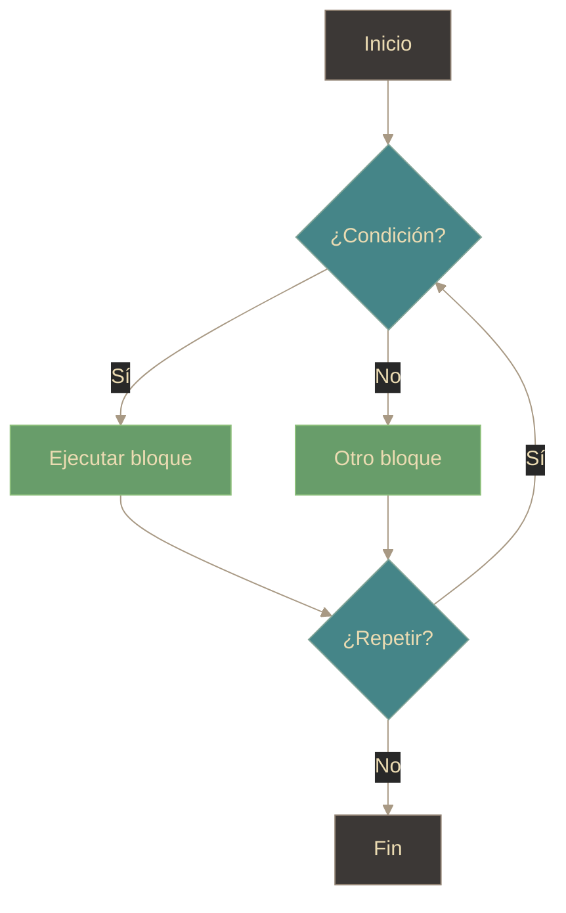

# JS - Estructuras de control

## Definición
Las estructuras de control en JavaScript son construcciones que permiten dirigir el flujo de ejecución del código, tomando decisiones (condicionales) o repitiendo bloques de código (bucles) según ciertas condiciones. Algunos ejemplos comunes incluyen `if`, `else`, `switch`, `for`, `while` y `do...while`.

## Explicación
- *Qué problema resuelve*
    Permiten tomar decisiones y repetir acciones en función de condiciones dinámicas, haciendo que el código sea más flexible y adaptable a diferentes situaciones.
- *Cómo funciona por arriba*
    Utilizan condiciones booleanas para evaluar si ciertos bloques de código deben ejecutarse o repetirse, controlando así el flujo del programa.
- *Qué implica / qué permite*
    Facilitan la creación de lógica compleja en los programas, permitiendo que el código responda a diferentes entradas y estados de manera eficiente.

## Flujo general (idea)

## Palabras clave
- Estructuras de control
- Condicionales
- Bucles
- Flujo de ejecución
- Decisiones

## Comparaciones típicas
- vs [[14 - JS - Funciones]]: control define el flujo (if/for/while); funciones encapsulan lógica reutilizable.
- vs [[03 - HTML - Definición]]: HTML estructura contenido; JS decide qué se ejecuta y cuándo (comportamiento).

## Preguntas de examen
- ¿Qué es una estructura de control en JavaScript?
- ¿Para qué sirve una estructura de control?
- ¿Cuál es la diferencia entre condicionales y bucles?
- ¿Qué pasa si una condición nunca se cumple en un bucle?

## Errores comunes
- Confundir condicionales con bucles.
- Olvidar actualizar la condición en un bucle, causando bucles infinitos.
- No usar llaves `{}` en bloques de código, lo que puede llevar a errores de ejecución.

## Mini-ejemplo (mental)
- Son como señales de tráfico en una carretera: las condicionales (if/else) deciden qué camino tomar según las condiciones (semáforos), y los bucles (for/while) son como vueltas repetitivas en un circuito hasta que se cumple una condición específica (llegar a la meta).
