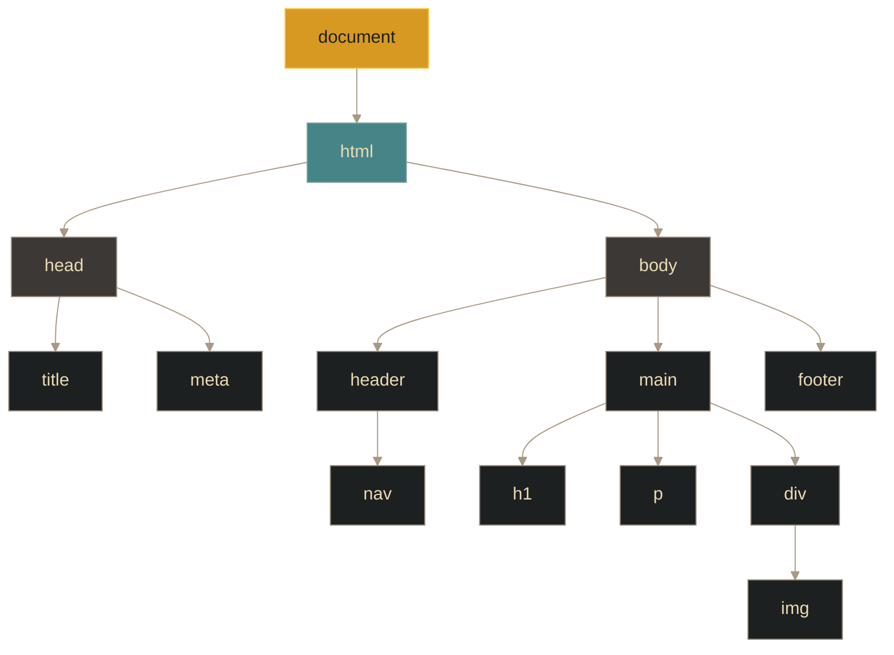

# DOM - Manipulación del DOM

## Definición

El Document Object Model (DOM) es una interfaz de programación que representa una página web como un **árbol de objetos estructurado**. Convierte el código HTML estático en una estructura dinámica que JavaScript puede manipular en tiempo real.

## Explicación

- *Qué problema resuelve*
    Antes del DOM (finales de los 90), las páginas web eran estáticas. Cualquier cambio requería recargar la página completa. El DOM permite actualizar partes específicas, responder a interacciones y crear aplicaciones interactivas sin recargas.

- *Cómo funciona por arriba*
    - El navegador parsea el HTML y construye un árbol en memoria
    - Cada elemento HTML es un **nodo** en el árbol
    - JavaScript accede mediante el objeto global `document`
    - Los cambios en el DOM se reflejan inmediatamente en la página

- *Qué implica / qué permite*
    - Modificar contenido, atributos y estilos en tiempo real
    - Agregar, eliminar o mover elementos dinámicamente
    - Crear SPAs (Single Page Applications)
    - Validar formularios con feedback inmediato

## Estructura del árbol DOM

## Tipos de nodos

| Tipo | Descripción | Ejemplo |
|------|-------------|---------|
| **Element** | Nodos de elemento HTML | `
`, `
`, `<button>` |
| **Text** | Contenido textual | Texto dentro de un `
` |
| **Attribute** | Atributos de elementos | `id`, `class`, `src` |
| **Document** | Nodo raíz | `document` |

## Métodos principales de acceso

| Método | Qué retorna | Característica clave |
|--------|-------------|---------------------|
| `getElementById()` | Elemento único | Más rápido, usa índice interno |
| `querySelector()` | Primer elemento | Sintaxis CSS completa |
| `querySelectorAll()` | NodeList estática | No se actualiza automáticamente |
| `getElementsByClassName()` | HTMLCollection "viva" | Se actualiza si cambia el DOM |

> **Diferencia clave**: Colecciones "vivas" (`getElementsBy*`) se actualizan automáticamente; `querySelectorAll` retorna una instantánea estática.

## Manipulación básica

### Operaciones fundamentales:
1. **Crear**: `createElement()` - genera un nuevo nodo
2. **Modificar**: `textContent`, `innerHTML`, `setAttribute()` - cambia contenido y propiedades
3. **Insertar**: `appendChild()`, `insertBefore()` - agrega al árbol
4. **Eliminar**: `remove()` - quita del árbol
5. **Navegar**: `parentNode`, `children`, `nextSibling` - recorre el árbol

### Optimización de rendimiento:
- Minimizar accesos al DOM (son costosos)
- Usar `DocumentFragment` para múltiples inserciones
- Modificar elementos "off-DOM" antes de insertar
- Evitar cambios en bucles intensivos

## Palabras clave

- DOM
- Nodo (Node)
- Elemento
- Árbol de documento
- `document`
- Colección viva vs estática
- DocumentFragment

## Comparaciones típicas

- vs [[08 - Eventos - Event flow (fases y flujo)]]: el DOM es la estructura; los eventos son interacciones sobre esa estructura
- vs [[06 - Web - Sitios dinámicos]]: el DOM permite dinamismo del lado del cliente sin recargar

## Preguntas de examen

- ¿Qué es el DOM y qué problema resuelve?
- ¿Cómo se representa la estructura de un documento en el DOM?
- ¿Cuál es la diferencia entre una colección "viva" y una "estática"?
- ¿Por qué es importante minimizar las operaciones DOM?
- ¿Qué es `DocumentFragment` y para qué se usa?

## Errores comunes

- Confundir DOM con HTML: el DOM es la representación en memoria, no el código fuente
- Usar `innerHTML` con datos no confiables (riesgo de XSS)
- No esperar a que el DOM esté cargado antes de manipularlo
- Manipular el DOM dentro de bucles intensivos (reflows costosos)
- No entender diferencia entre propiedades DOM y atributos HTML

## Mini-ejemplo (mental)

El DOM es como **un muñeco de plastilina**: tiene una forma inicial (el HTML), pero puedes moldearlo en tiempo real: añadir piezas, quitar partes, cambiar colores, todo sin crear uno nuevo desde cero.
