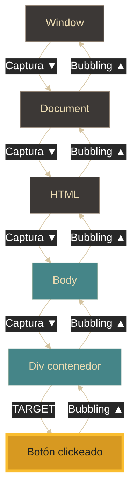
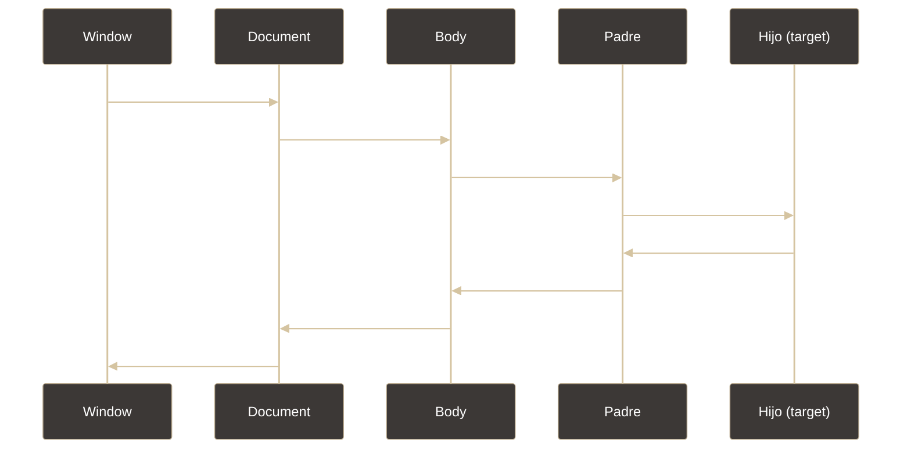

# Eventos - Event flow (fases y flujo)

## Definición

El **event flow** es el mecanismo por el cual los eventos se propagan a través del DOM cuando ocurren. Define el orden en que los elementos reciben el evento, pasando por tres fases: **capturing** (captura), **target** (objetivo) y **bubbling** (burbujeo).

## Explicación

- *Qué problema resuelve*
    En una estructura de árbol como el DOM, cuando ocurre un evento podría afectar a múltiples elementos anidados. El event flow define un orden predecible para que cada elemento pueda responder, permitiendo control granular y optimización mediante delegación.

- *Cómo funciona por arriba*
    - El evento viaja desde la raíz hacia el elemento objetivo (**captura**)
    - Al llegar al elemento donde ocurrió, se ejecutan los listeners (**target**)
    - Luego el evento "burbujea" de vuelta hacia la raíz (**bubbling**)
    - Por defecto, los listeners se ejecutan en fase de bubbling
    - Se puede detener la propagación con `stopPropagation()`

- *Qué implica / qué permite*
    - Delegación de eventos: un listener en el padre maneja múltiples hijos
    - Control del orden de ejecución de manejadores
    - Optimización de rendimiento (menos listeners)
    - Implementación del patrón Observer

## Las tres fases del event flow

### 1. Capturing (Fase de captura)

- El evento **desciende** desde el documento hacia el objetivo
- Orden: `window` → `document` → `html` → `body` → ... → objetivo
- Es como el evento "buscando" el elemento donde ocurrió
- Raramente se usa, pero útil para interceptar antes de llegar al destino

### 2. Target (Fase del objetivo)

- El evento llega al elemento específico donde ocurrió
- Es el punto focal del evento
- `event.target` siempre referencia a este elemento

### 3. Bubbling (Fase de burbujeo)

- El evento **asciende** desde el objetivo hacia la raíz
- Orden: objetivo → ... → `body` → `html` → `document` → `window`
- Es como una burbuja que sube desde donde se originó
- La mayoría de eventos burbujean por defecto

## Orden de ejecución

## Delegación de eventos

Técnica que aprovecha el bubbling para manejar eventos de múltiples elementos hijos desde un ancestro común.

**Ventajas:**
- Un solo listener para muchos elementos (mejor rendimiento)
- Funciona con elementos añadidos dinámicamente
- Menos código y mejor mantenibilidad

## Palabras clave

- Event flow
- Capturing (captura)
- Target (objetivo)
- Bubbling (burbujeo)
- Propagación
- Delegación de eventos
- stopPropagation

## Comparaciones típicas

- vs [[10 - Eventos - Objeto event]]: el flow describe cómo se propaga; el objeto event contiene la información y métodos de control
- vs [[09 - Eventos - Eventos comunes en la web]]: el flow es el "cómo se propaga"; los eventos son el "qué tipos existen"

## Preguntas de examen

- ¿Cuáles son las tres fases del event flow?
- ¿En qué orden ocurren: capturing o bubbling primero?
- ¿Qué es la delegación de eventos y cuáles son sus ventajas?
- ¿Para qué sirve `stopPropagation()`?
- ¿Por qué la mayoría de los listeners usan la fase de bubbling?

## Errores comunes

- Confundir el orden de las fases: captura va PRIMERO, luego bubbling
- Pensar que todos los eventos burbujean (focus y blur no lo hacen)
- No usar delegación cuando hay muchos elementos similares
- Crear memory leaks al no remover listeners
- Confundir `event.target` (origen) con `event.currentTarget` (listener)

## Mini-ejemplo (mental)

El event flow es como **una pelota que lanzan desde lo alto de una escalera**: bota escalón por escalón hacia abajo (captura), llega al suelo (target), y si no la detienen, rebota subiendo de nuevo (bubbling). `stopPropagation()` es como poner una red que detiene el rebote.
