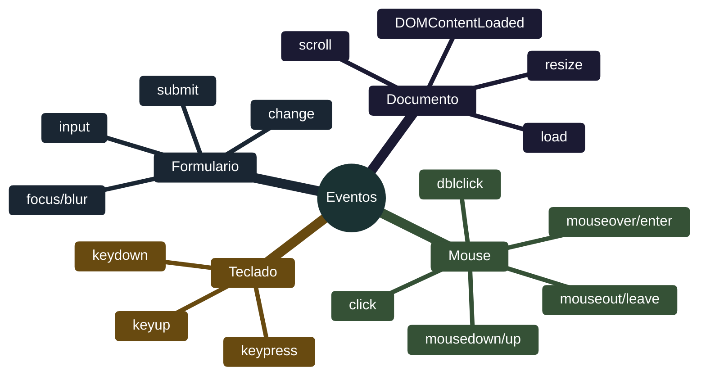
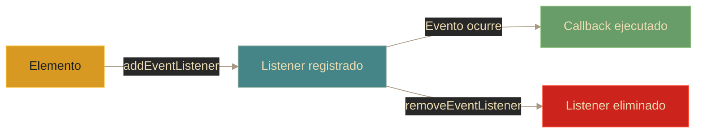

# Eventos - Eventos comunes en la web

## Definición

Los eventos son acciones o sucesos que ocurren en el navegador y a los cuales JavaScript puede reaccionar. Son la base de la **interactividad web**, permitiendo que las aplicaciones respondan a acciones del usuario.

## Explicación

- *Qué problema resuelve*
    Sin eventos, las páginas web serían documentos estáticos. Los eventos son el puente entre las acciones del usuario (clicks, teclado) y el código JavaScript que reacciona a ellas.

- *Cómo funciona por arriba*
    - El navegador monitorea constantemente acciones del usuario
    - Cuando ocurre un evento, crea un **objeto event** con información del suceso
    - El evento se propaga por el DOM siguiendo el event flow
    - JavaScript "escucha" con `addEventListener` y ejecuta código en respuesta
    - Sigue el patrón **Observer**: elementos emiten, código observa

- *Qué implica / qué permite*
    - Responder a interacciones en tiempo real
    - Validar formularios antes de enviar
    - Crear animaciones y transiciones
    - Implementar navegación SPA
    - Detectar cambios de estado

## Categorías de eventos

## Eventos de mouse

| Evento | Descripción | Diferencia clave |
|--------|-------------|------------------|
| `click` | Click simple | Presionar + soltar |
| `dblclick` | Doble click | Dos clicks rápidos |
| `mousedown` | Botón presionado | Al bajar el dedo |
| `mouseup` | Botón liberado | Al subir el dedo |
| `mouseover` | Mouse entra | **Burbujea** - entra a hijos también |
| `mouseenter` | Mouse entra | **No burbujea** - solo este elemento |
| `mouseout` | Mouse sale | **Burbujea** |
| `mouseleave` | Mouse sale | **No burbujea** |
| `mousemove` | Mouse se mueve | Se dispara continuamente |

> **Nota**: `mouseenter/mouseleave` son más eficientes que `mouseover/mouseout` porque no se propagan a hijos.

## Eventos de teclado

| Evento | Cuándo ocurre | Info disponible |
|--------|---------------|-----------------|
| `keydown` | Al presionar | `key`, `code`, modifiers (ctrlKey, shiftKey) |
| `keyup` | Al soltar | Útil para detectar fin de pulsación |
| `keypress` | Al presionar (obsoleto) | ⚠️ No usar, usar `keydown` |

**Propiedades útiles:**
- `event.key`: Valor de la tecla ("Enter", "a", "ArrowUp")
- `event.code`: Código físico ("KeyA", "Enter")
- `event.ctrlKey/shiftKey/altKey`: true si está presionado

## Eventos de formulario

| Evento | Disparo | Uso típico |
|--------|---------|------------|
| `submit` | Formulario enviado | Validar, prevenir recarga con `preventDefault()` |
| `input` | Valor cambia (instantáneo) | Validación en tiempo real |
| `change` | Valor cambió + perdió foco | Validar al terminar de editar |
| `focus` | Elemento recibe foco | Mostrar ayuda |
| `blur` | Elemento pierde foco | Validar al salir |

**Secuencia típica:**
1. Usuario escribe → `input` (cada tecla)
2. Usuario termina → `change` (al salir)
3. Usuario envía → `submit` (validar y procesar)

## Eventos de documento/ventana

| Evento | Disparo | Uso |
|--------|---------|-----|
| `DOMContentLoaded` | DOM parseado listo | Inicializar app (más rápido) |
| `load` | Todo cargado (imágenes, CSS) | Cuando necesitas recursos completos |
| `scroll` | Scroll en página | Lazy loading, animaciones |
| `resize` | Ventana cambia tamaño | Layout responsive |
| `beforeunload` | Antes de cerrar página | Confirmar cambios sin guardar |

**Diferencia clave:** `DOMContentLoaded` vs `load`
- **DOMContentLoaded**: HTML parseado, DOM listo. No espera imágenes/CSS.
- **load**: Todo completamente cargado. Más lento.

## Gestión de listeners

**Opciones útiles:**
- `{ once: true }`: Se ejecuta una sola vez y se auto-elimina
- `{ capture: true }`: Ejecuta en fase de captura
- Funciones nombradas: Necesarias para poder remover el listener después

## Palabras clave

- Event listener
- addEventListener
- Eventos de mouse/teclado/formulario
- DOMContentLoaded
- preventDefault
- Bubbling

## Comparaciones típicas

- vs [[08 - Eventos - Event flow]]: eventos comunes son los "tipos"; el flow es el "cómo se propagan"
- vs [[10 - Eventos - Objeto event]]: cada evento genera un objeto con propiedades específicas
- vs [[07 - DOM - Manipulación]]: eventos son la causa, manipulación del DOM es el efecto

## Preguntas de examen

- ¿Qué diferencia hay entre `click`, `mousedown` y `mouseup`?
- ¿Cuál es la diferencia entre `input` y `change`?
- ¿Por qué usar `preventDefault()` en el evento `submit`?
- ¿Cuándo usar `DOMContentLoaded` vs `load`?
- ¿Qué eventos de mouse burbujean y cuáles no?
- ¿Para qué sirve la opción `{ once: true }`?

## Errores comunes

- No usar `preventDefault()` cuando se debe evitar comportamiento por defecto
- No eliminar listeners → memory leaks
- Usar funciones anónimas cuando se necesita remover el listener
- No considerar accesibilidad (teclado, no solo mouse)
- Usar `keypress` (obsoleto) en lugar de `keydown`
- Muchos listeners individuales en lugar de delegación

## Mini-ejemplo (mental)

Los eventos son como **sensores en una casa inteligente**: sensores de movimiento (mousemove), botones de timbre (click), teclados de alarma (keydown), detectores de puertas (change). Cada sensor está conectado a un sistema central que decide qué hacer: encender luces, mostrar mensajes, activar alarmas...
