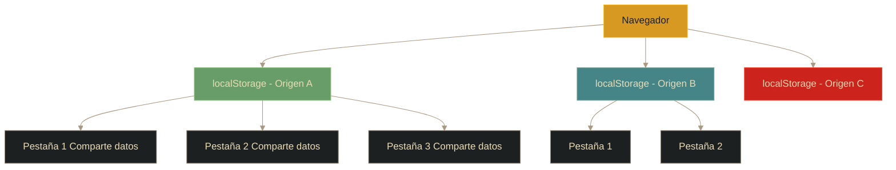
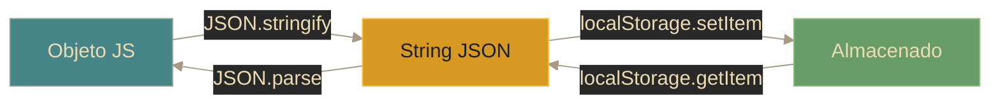

# Storage - localStorage

## Definición

localStorage es una API de almacenamiento web que permite guardar datos de forma **persistente** en el navegador. Los datos permanecen disponibles incluso después de cerrar el navegador o apagar el dispositivo, hasta que se eliminan explícitamente.

## Explicación

- *Qué problema resuelve*
    Permite almacenar datos localmente sin depender de cookies (límite ~4KB, se envían en cada request) ni servidor. Ideal para preferencias, estados de app, caché local.

- *Cómo funciona por arriba*
    - Parte de la Web Storage API (`window.localStorage`)
    - Almacena pares **clave-valor** como strings
    - Aislamiento por **origen** (protocolo + dominio + puerto)
    - Capacidad: ~5-10 MB por origen
    - Operaciones **síncronas** (pueden bloquear con grandes volúmenes)
    - Datos guardados en disco (SQLite del navegador)

- *Qué implica / qué permite*
    - Persistencia entre sesiones de navegación
    - Compartir datos entre pestañas del mismo dominio
    - Reducir llamadas al servidor (caché local)
    - Funcionalidad offline básica
    - ⚠️ **No se envía automáticamente al servidor** (a diferencia de cookies)

## Arquitectura del almacenamiento

## API y métodos

| Método | Acción |
|--------|--------|
| `setItem(clave, valor)` | Guarda un par clave-valor |
| `getItem(clave)` | Obtiene el valor de una clave |
| `removeItem(clave)` | Elimina un item específico |
| `clear()` | Elimina TODOS los items |
| `length` | Cantidad de items almacenados |
| `key(indice)` | Obtiene la clave en esa posición |

> **Importante**: Solo almacena **strings**. Para objetos, usar `JSON.stringify()` al guardar y `JSON.parse()` al recuperar.

## Serialización de datos

**Proceso:**
1. Guardar: `localStorage.setItem('usuario', JSON.stringify(objeto))`
2. Recuperar: `JSON.parse(localStorage.getItem('usuario'))`
3. Sin serializar: guarda `"[object Object]"` (inútil)

## Limitaciones y consideraciones

| Aspecto | Detalle |
|---------|---------|
| **Capacidad** | ~5-10 MB por origen |
| **Tipo de datos** | Solo strings (serializar objetos) |
| **Síncrono** | Puede bloquear el hilo principal |
| **Seguridad** | ⚠️ Vulnerable a XSS, no datos sensibles |
| **Persistencia** | Permanente hasta eliminación manual |
| **Scope** | Por origen (aislado entre dominios) |
| **Modo privado** | Puede no estar disponible o limpiarse |

## Casos de uso recomendados

✅ **Usar para:**
- Preferencias de usuario (tema, idioma)
- Estado de UI (sidebar colapsado, etc.)
- Caché de datos que cambian poco
- Historial de búsquedas recientes
- Carritos de compra persistentes

❌ **NO usar para:**
- Tokens de autenticación (usar cookies HttpOnly)
- Información sensible (contraseñas, tarjetas)
- Datos que deben sincronizarse con servidor
- Grandes volúmenes de datos (>5MB)

## Palabras clave

- localStorage
- Web Storage API
- Persistencia
- Serialización (JSON)
- Origen (origin)
- Síncrono
- XSS

## Comparaciones típicas

- vs [[14 - Storage - sessionStorage]]: localStorage persiste y se comparte entre pestañas; sessionStorage es temporal y aislado por pestaña
- vs [[15 - Cookies - Crear y usar cookies en JS]]: localStorage tiene más capacidad (~5MB vs ~4KB), no se envía al servidor, no expira

## Preguntas de examen

- ¿Cuál es la diferencia principal entre localStorage y sessionStorage?
- ¿Por qué es necesario usar `JSON.stringify()` con objetos?
- ¿Cuál es la capacidad típica de localStorage?
- ¿Por qué NO es recomendable para datos sensibles?
- ¿Qué sucede con los datos al cerrar el navegador?
- ¿Los datos de localStorage se envían automáticamente al servidor?

## Errores comunes

- Guardar objetos sin serializar → `"[object Object]"`
- Almacenar datos sensibles (vulnerable a XSS)
- No manejar `QuotaExceededError` (superar límite de 5MB)
- Olvidar que `getItem` retorna `null` si no existe (no `undefined`)
- Bloquear el hilo principal con operaciones grandes
- Confundir persistencia con seguridad

## Mini-ejemplo (mental)

El localStorage es como **un cajón de tu escritorio**: guardas cosas y permanecen incluso si cierras la oficina. Otras personas en la misma oficina (pestañas del sitio) pueden ver el contenido. Pero **no es una caja fuerte**: cualquiera con acceso puede abrirlo (XSS), y no llevas el contenido contigo al salir (no se envía al servidor).
