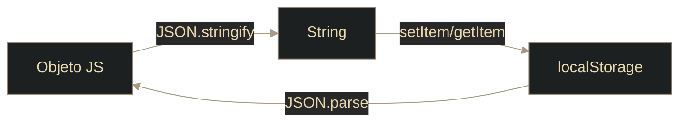

# Storage - localStorage

## Definición

`localStorage` guarda datos en el navegador de forma persistente (hasta que se borren manualmente).

## Explicación

- *Qué problema resuelve*
    Mantiene estado del lado cliente sin depender de cookies o backend para datos simples.

- *Cómo funciona por arriba*
    - API: `window.localStorage`
    - Guarda pares clave-valor como texto
    - Es por origen (dominio/protocolo/puerto)
    - Se comparte entre pestañas del mismo origen

- *Qué implica / qué permite*
    - Persistencia entre sesiones
    - Preferencias y caché local simple
    - No apto para datos sensibles

## API básica

- `setItem(clave, valor)`
- `getItem(clave)`
- `removeItem(clave)`
- `clear()`
- `length`

## Datos complejos

## Palabras clave

- localStorage
- Persistencia
- Web Storage
- JSON.stringify
- JSON.parse
- Origen

## Comparaciones típicas

- vs [[14 - Storage - sessionStorage]]: localStorage persiste y se comparte entre pestañas
- vs [[15 - Cookies - Crear y usar cookies en JS]]: localStorage no se envía automáticamente al servidor

## Preguntas de examen

- ¿Qué diferencia clave hay entre localStorage y sessionStorage?
- ¿Por qué hay que serializar objetos con JSON?
- ¿Por qué no conviene guardar tokens sensibles en localStorage?

## Errores comunes

- Guardar objetos sin serializar
- Guardar información sensible
- Asumir que `getItem` devuelve `undefined` (devuelve `null` si no existe)

## Mini-ejemplo (mental)

Es como un cajón que queda en tu escritorio aunque cierres la oficina: sigue ahí la próxima vez.
