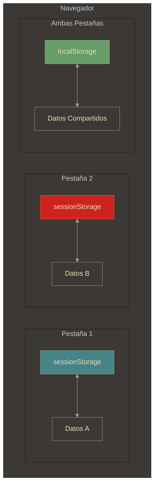

# Storage - sessionStorage

## Definición

sessionStorage es una API de almacenamiento web que guarda datos **temporalmente** durante la sesión de navegación de una pestaña. Los datos se eliminan automáticamente al cerrar la pestaña, aunque sobreviven a recargas (F5) dentro de la misma.

## Explicación

- *Qué problema resuelve*
    Mantiene estado temporal durante la navegación sin persistir datos innecesariamente. Ideal para formularios multi-paso, datos temporales, estados de UI que no deben mantenerse entre sesiones.

- *Cómo funciona por arriba*
    - Parte de Web Storage API (`window.sessionStorage`)
    - Almacena pares **clave-valor** como strings
    - **Aislado por pestaña**: cada pestaña tiene su propio storage
    - Los datos sobreviven a F5 pero se eliminan al cerrar la pestaña
    - Capacidad: ~5-10 MB (igual que localStorage)
    - **No se comparte** entre pestañas del mismo sitio

- *Qué implica / qué permite*
    - Mantener datos temporales durante la sesión
    - Aislar datos entre pestañas (a diferencia de localStorage)
    - Prevenir pérdida de datos por recarga accidental
    - Implementar flujos multi-paso sin persistencia permanente
    - ⚠️ **No confundir** con "sesión de usuario" del servidor (conceptos distintos)

## Aislamiento por pestaña

**Diferencia clave:**
- **sessionStorage**: Aislado por pestaña. Pestaña 1 y 2 tienen datos diferentes.
- **localStorage**: Compartido. Ambas pestañas ven los mismos datos.

## API

Misma API que localStorage:
- `setItem(clave, valor)` - Guardar
- `getItem(clave)` - Obtener
- `removeItem(clave)` - Eliminar uno
- `clear()` - Eliminar todos
- `length` - Cantidad de items

> **Igual que localStorage**: Solo strings. Usar `JSON.stringify/parse` para objetos.

## Comparativa: sessionStorage vs localStorage vs Cookies

| Característica | sessionStorage | localStorage | Cookies |
|----------------|----------------|--------------|---------|
| **Persistencia** | Temporal (hasta cerrar pestaña) | Permanente | Configurable |
| **Scope** | Por pestaña | Por origen (compartido) | Por dominio |
| **Capacidad** | ~5-10 MB | ~5-10 MB | ~4 KB |
| **Envío al servidor** | ❌ No | ❌ No | ✅ Sí (cada request) |
| **Sobrevive a F5** | ✅ Sí | ✅ Sí | ✅ Sí |
| **Sobrevive cerrar pestaña** | ❌ No | ✅ Sí | Depende |

## Casos de uso

✅ **Usar para:**
- Formularios multi-paso (wizard)
- Carritos temporales (solo esta visita)
- Estados de UI temporales
- Prevención de pérdida de datos (F5)
- Historial de navegación en la app

❌ **NO usar para:**
- Datos que deben persistir entre sesiones (usar localStorage)
- Datos sensibles (tokens, contraseñas)
- Compartir entre pestañas (usar localStorage)

## Palabras clave

- sessionStorage
- Web Storage API
- Sesión de navegación
- Temporal
- Aislamiento por pestaña
- Client-side

## Comparaciones típicas

- vs [[13 - Storage - localStorage]]: sessionStorage es temporal y aislado; localStorage persiste y se comparte
- vs [[15 - Cookies - Crear y usar cookies en JS]]: sessionStorage no se envía al servidor; cookies sí
- vs "Sesión de servidor": sessionStorage es del navegador (cliente); sesión de servidor es backend

## Preguntas de examen

- ¿Cuál es la diferencia principal entre sessionStorage y localStorage?
- ¿Cuándo se borran los datos de sessionStorage?
- ¿Se comparte sessionStorage entre pestañas del mismo sitio?
- ¿Sobreviven los datos a una recarga (F5)?
- ¿Cuál es la diferencia entre "sesión del navegador" y "sesión de usuario" del servidor?

## Errores comunes

- **Asumir que comparte entre pestañas**: Cada pestaña es aislada
- **Confundir con sesión de servidor**: Cerrar pestaña ≠ cerrar sesión backend
- **No serializar objetos**: Guarda `"[object Object]"` sin JSON.stringify
- **Guardar datos sensibles**: Vulnerable a XSS igual que localStorage
- **No manejar estado inicial vacío**: El usuario puede abrir la página directamente

## Mini-ejemplo (mental)

El sessionStorage es como **una pizarra blanca en tu escritorio**: escribes notas mientras trabajas, y si te levantas a tomar café y vuelves (F5), siguen ahí. Pero si te mudas a otra mesa (nueva pestaña) o te vas a casa (cerrar pestaña), la pizarra se borra. Nadie en otras mesas ve lo que escribiste (aislamiento).
