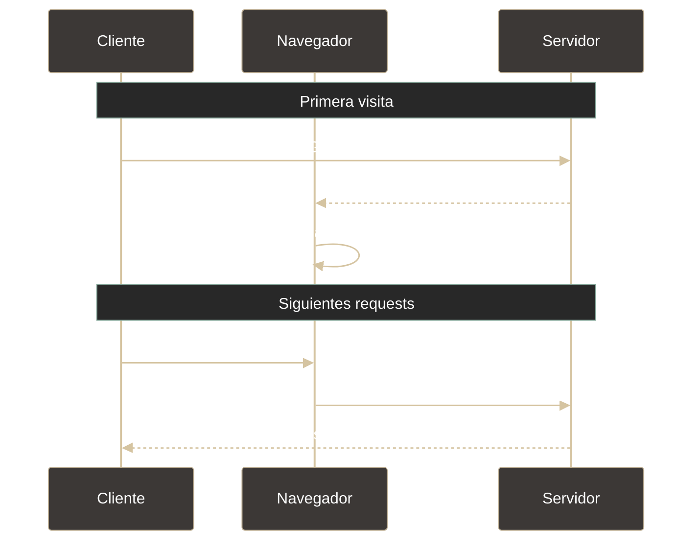

# Cookies - Crear y usar cookies en JS

## Definición

Las cookies son pequeños fragmentos de datos que un **servidor envía al navegador** y que el navegador almacena para **reenviarlos automáticamente** en cada solicitud posterior al mismo dominio. Se usan para mantener sesiones, preferencias y tracking.

## Explicación

- *Qué problema resuelve*
    HTTP es **stateless** (sin estado): cada petición es independiente y el servidor no "recuerda" al usuario. Las cookies permiten mantener **estado entre peticiones**, identificando usuarios y recordando información.

- *Cómo funciona por arriba*
    1. Servidor envía cookie mediante header `Set-Cookie` en respuesta HTTP
    2. Navegador almacena la cookie asociada al dominio
    3. En cada solicitud posterior, navegador envía automáticamente cookie en header `Cookie`
    4. Servidor lee la cookie y recupera estado del usuario
    5. Atributos controlan: expiración, dominio, path, seguridad

- *Qué implica / qué permite*
    - Mantener sesiones de usuario (login persistente)
    - Recordar preferencias entre visitas
    - Rastrear actividad (analytics, publicidad)
    - Almacenar tokens de autenticación
    - ⚠️ Se envían en **cada request** (overhead de red)

## Ciclo de vida de una cookie



## Estructura de una cookie

```
nombre=valor; Domain=ejemplo.com; Path=/; Expires=...; Max-Age=3600; Secure; HttpOnly; SameSite=Strict
```

| Atributo | Propósito |
|----------|-----------|
| `nombre=valor` | Dato almacenado (único obligatorio) |
| `Domain` | Dominio asociado |
| `Path` | Ruta válida |
| `Expires/Max-Age` | Fecha de expiración |
| `Secure` | Solo HTTPS |
| `HttpOnly` | No accesible por JavaScript |
| `SameSite` | Política cross-site (Strict/Lax/None) |

## Tipos de cookies

| Tipo | Duración | Características |
|------|----------|-----------------|
| **Sesión** | Hasta cerrar navegador | En memoria, no expiración |
| **Persistentes** | Hasta fecha definida | En disco, sobreviven reinicios |
| **Primera parte** | Del dominio visitado | Más confiables |
| **Terceros** | De dominios externos | Tracking, bloqueadas por navegadores modernos |

## Limitaciones

| Aspecto | Límite |
|---------|--------|
| **Tamaño** | ~4KB por cookie |
| **Cantidad** | 20-50 cookies por dominio |
| **Headers** | ~4KB-8KB total de cookies enviadas |
| **Overhead** | Se envían en CADA request HTTP |

## Atributos de seguridad

| Atributo | Cuándo usar | Protección |
|----------|-------------|------------|
| **Secure** | Siempre en producción | Solo HTTPS |
| **HttpOnly** | Tokens de sesión | Previene acceso por XSS |
| **SameSite=Strict** | Máxima seguridad | Previene CSRF |
| **SameSite=Lax** | Balance seguridad/usabilidad | Permite navegación normal |

## JavaScript y cookies

```javascript
// Crear cookie
document.cookie = "usuario=Juan; max-age=3600; path=/; Secure";

// Leer cookies (devuelve string con todas)
console.log(document.cookie); // "usuario=Juan; tema=oscuro"

// Eliminar cookie (expirarla)
document.cookie = "usuario=; expires=Thu, 01 Jan 1970 00:00:00 UTC; path=/;";
```

> **Nota**: `document.cookie` no da acceso a cookies con flag `HttpOnly` (solo servidor).

## Palabras clave

- Cookie
- Set-Cookie / Cookie (headers)
- Expires / Max-Age
- Secure / HttpOnly / SameSite
- Sesión vs Persistentes
- Stateless HTTP

## Comparaciones típicas

- vs [[13 - Storage - localStorage]]: cookies se envían al servidor en cada request; localStorage tiene más espacio y no se envía
- vs [[14 - Storage - sessionStorage]]: cookies pueden persistir; sessionStorage es temporal y aislado
- vs [[11 - HTTP - Headers]]: cookies viajan en headers `Cookie` y `Set-Cookie`

## Preguntas de examen

- ¿Por qué HTTP es stateless y cómo las cookies solucionan esto?
- ¿Qué diferencia hay entre cookie de sesión y persistente?
- ¿Para qué sirven Secure, HttpOnly y SameSite?
- ¿Cuál es el tamaño máximo de una cookie?
- ¿Las cookies se envían automáticamente al servidor?

## Errores comunes

- Almacenar datos sensibles sin encriptar
- No usar `HttpOnly` para tokens (vulnerable a XSS)
- No usar `Secure` en producción (envío por HTTP)
- Crear demasiadas cookies grandes (ralentiza requests)
- Confundir `Expires` (fecha) con `Max-Age` (segundos)
- Intentar leer cookies `HttpOnly` desde JavaScript

## Mini-ejemplo (mental)

Las cookies son como **pulseras de identificación en un evento**: al llegar te dan una pulsera con tu nombre. En cada acceso posterior, la muestras automáticamente sin decir quién eres. Tiene fecha de validez, tipo de acceso (VIP/General), y medidas de seguridad anti-falsificación.
