# HTTP - Obtener parámetros desde la URL

## Definición

Los query params son pares `clave=valor` que viajan en la URL después de `?`.

## Explicación

- *Qué problema resuelve*
    Permite compartir estado simple (filtros, búsqueda, paginación) sin guardar datos en storage.

- *Cómo funciona por arriba*
    - Formato: `?a=1&b=2`
    - En JS se leen con `URLSearchParams`
    - Son visibles para el usuario

- *Qué implica / qué permite*
    - URLs compartibles con estado
    - Mejor navegación (atrás/adelante)
    - No usar para datos sensibles

## API útil (`URLSearchParams`)

- `get('clave')`
- `has('clave')`
- `getAll('clave')`
- `set('clave', 'valor')`
- `delete('clave')`
- `toString()`

## Mini-flujo

```mermaid
%%{init: {'theme': 'base', 'themeVariables': { 'darkMode': true, 'background': '#1d2021', 'primaryColor': '#3c3836', 'primaryTextColor': '#ffffff', 'primaryBorderColor': '#bdae93', 'secondaryColor': '#504945', 'secondaryTextColor': '#ffffff', 'secondaryBorderColor': '#bdae93', 'tertiaryColor': '#282828', 'tertiaryTextColor': '#ffffff', 'tertiaryBorderColor': '#a89984', 'lineColor': '#d5c4a1', 'textColor': '#ffffff', 'mainBkg': '#282828', 'nodeBkg': '#3c3836', 'nodeTextColor': '#ffffff', 'nodeBorder': '#bdae93', 'clusterBkg': '#282828', 'clusterBorder': '#a89984', 'defaultLinkColor': '#d5c4a1', 'titleColor': '#ffffff', 'edgeLabelBackground': '#282828', 'labelBoxBkgColor': '#3c3836', 'labelBoxBorderColor': '#bdae93', 'labelTextColor': '#ffffff', 'loopTextColor': '#ffffff', 'noteBkgColor': '#282828', 'noteTextColor': '#ffffff', 'noteBorderColor': '#83a598', 'actorBkg': '#3c3836', 'actorBorder': '#bdae93', 'actorTextColor': '#ffffff', 'actorLineColor': '#d5c4a1', 'signalColor': '#d5c4a1', 'signalTextColor': '#ffffff', 'activationBkgColor': '#689d6a', 'activationBorderColor': '#8ec07c', 'sequenceNumberColor': '#ffffff'}, 'themeCSS': 'text, tspan { fill: #ffffff !important; color: #ffffff !important; } .messageText, .labelText, .loopText, .noteText, .actor text, .taskText, .sectionTitle text, .nodeLabel, .edgeLabel, .cluster-label text { fill: #ffffff !important; color: #ffffff !important; } .messageLine0, .messageLine1, .actor-line, .edgePath .path { stroke: #d5c4a1 !important; } .note { fill: #282828 !important; stroke: #83a598 !important; } .labelBox, .edgeLabel rect { fill: #3c3836 !important; stroke: #bdae93 !important; }'}}%%
flowchart LR
    A[window.location.search] --> B[URLSearchParams]
    B --> C[get/set params]
    C --> D[URL final]
```

## Palabras clave

- Query string
- URLSearchParams
- GET
- `encodeURIComponent`
- Estado en URL

## Comparaciones típicas

- vs [[13 - Storage - localStorage]]: URL params son visibles y orientados a navegación; localStorage es interno del navegador
- vs [[12 - HTTP - Body]]: query params son cortos/visibles; body se usa para datos más grandes

## Preguntas de examen

- ¿Cómo se leen parámetros de URL en JS moderno?
- ¿Cuándo conviene pasar estado en URL?
- ¿Por qué no se deben enviar datos sensibles por query params?

## Errores comunes

- No codificar valores con caracteres especiales
- Asumir que un parámetro existe sin validar
- Poner tokens/contraseñas en la URL

## Mini-ejemplo (mental)

Es como enviar una carpeta con etiquetas pegadas afuera: todos ven esas etiquetas y se puede compartir exactamente esa vista.
