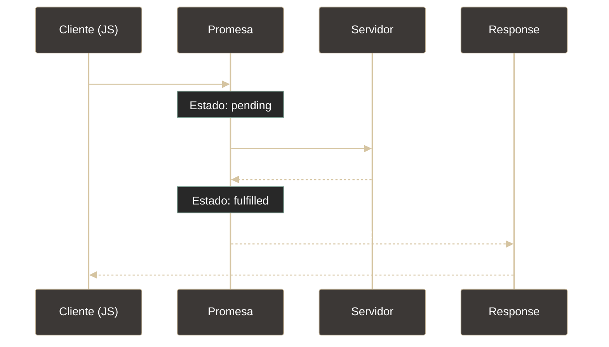
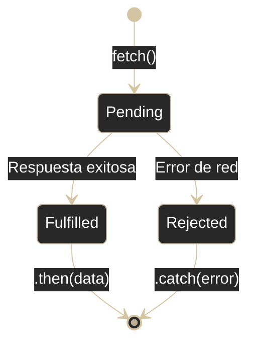

# JS - Fetch API

## Definición

Fetch API es la interfaz moderna de JavaScript para realizar **peticiones HTTP asíncronas** desde el navegador. Es la evolución de XMLHttpRequest, basada en Promesas, que permite comunicarse con servidores sin recargar la página.

## Explicación

- *Qué problema resuelve*
    Permite crear aplicaciones interactivas que obtienen datos del servidor en segundo plano, actualizan partes de la página sin recargarla completa, y comunican con APIs REST de manera legible y moderna.

- *Cómo funciona por arriba*
    - `fetch()` devuelve una **Promesa** que se resuelve con un objeto Response
    - Funciona de forma **asíncrona**: el código continúa ejecutándose mientras espera
    - Soporta métodos HTTP: GET, POST, PUT, PATCH, DELETE
    - Permite configurar headers, body y otras opciones
    - La respuesta debe procesarse según su tipo (JSON, texto, blob)

- *Qué implica / qué permite*
    - Consumir APIs REST (obtener/enviar datos)
    - Actualizar el DOM con datos nuevos sin recargar
    - Subir archivos usando FormData
    - Manejar autenticación (tokens JWT en headers)
    - Controlar CORS y caché

## Flujo de una petición fetch

## Ciclo de vida de una petición

## Métodos HTTP con fetch

| Método | Operación | ¿Lleva body? |
|--------|-----------|--------------|
| **GET** | Obtener recurso | No |
| **POST** | Crear recurso | Sí |
| **PUT** | Reemplazar completo | Sí |
| **PATCH** | Actualizar parcial | Sí |
| **DELETE** | Eliminar recurso | Opcional |

## La respuesta (Response)

El objeto Response contiene:
- `ok`: boolean (true si status 200-299)
- `status`: código HTTP (200, 404, 500, etc.)
- `statusText`: mensaje del estado
- Métodos para extraer datos: `.json()`, `.text()`, `.blob()`

> **Importante**: `fetch()` solo rechaza la promesa en errores de red (no llega al servidor). Errores HTTP (404, 500) se consideran respuestas exitosas desde el punto de vista de la conexión.

## Async/Await

Sintaxis moderna que hace el código asíncrono más legible, escribiéndose como si fuera síncrono.

**Ventajas:**
- Código más lineal y fácil de leer
- Manejo de errores con try/catch
- Menos anidamiento que .then()

## Palabras clave

- Fetch
- Promesa (Promise)
- HTTP Request/Response
- JSON
- API REST
- Async/Await
- CORS
- Headers

## Comparaciones típicas

- vs [[19 - JS - Promesas (Promises)]]: fetch devuelve promesas; es el caso de uso más común
- vs XMLHttpRequest: fetch es más moderno, usa promesas, sintaxis más limpia
- vs [[11 - HTTP - Headers]]: headers son esenciales en peticiones fetch
- vs [[12 - HTTP - Body]]: body se usa en POST/PUT/PATCH

## Preguntas de examen

- ¿Qué devuelve `fetch()` y por qué es importante?
- ¿Por qué es necesario llamar a `.json()` en la respuesta?
- ¿Cómo se manejan errores HTTP (404, 500) con fetch?
- ¿Qué es CORS y por qué causa errores?
- ¿Qué ventajas tiene async/await sobre .then()?

## Errores comunes

- No verificar `response.ok` (404/500 no entran en `.catch()` automáticamente)
- Olvidar que `fetch()` es asíncrono y usar datos antes de que se resuelva
- No establecer `Content-Type: application/json` al enviar JSON
- Confundirse con CORS al hacer peticiones cross-origin
- No convertir body a string con `JSON.stringify()` al enviar objetos

## Mini-ejemplo (mental)

Fetch es como **mandar a alguien a hacer un encargo a la tienda**: pides al mensajero (fetch) que vaya a una URL (tienda), y mientras esperas haces otras cosas (asincronía). Cuando vuelve, revisas si trajo lo pedido (`response.ok`) y abres el paquete (`.json()`).
