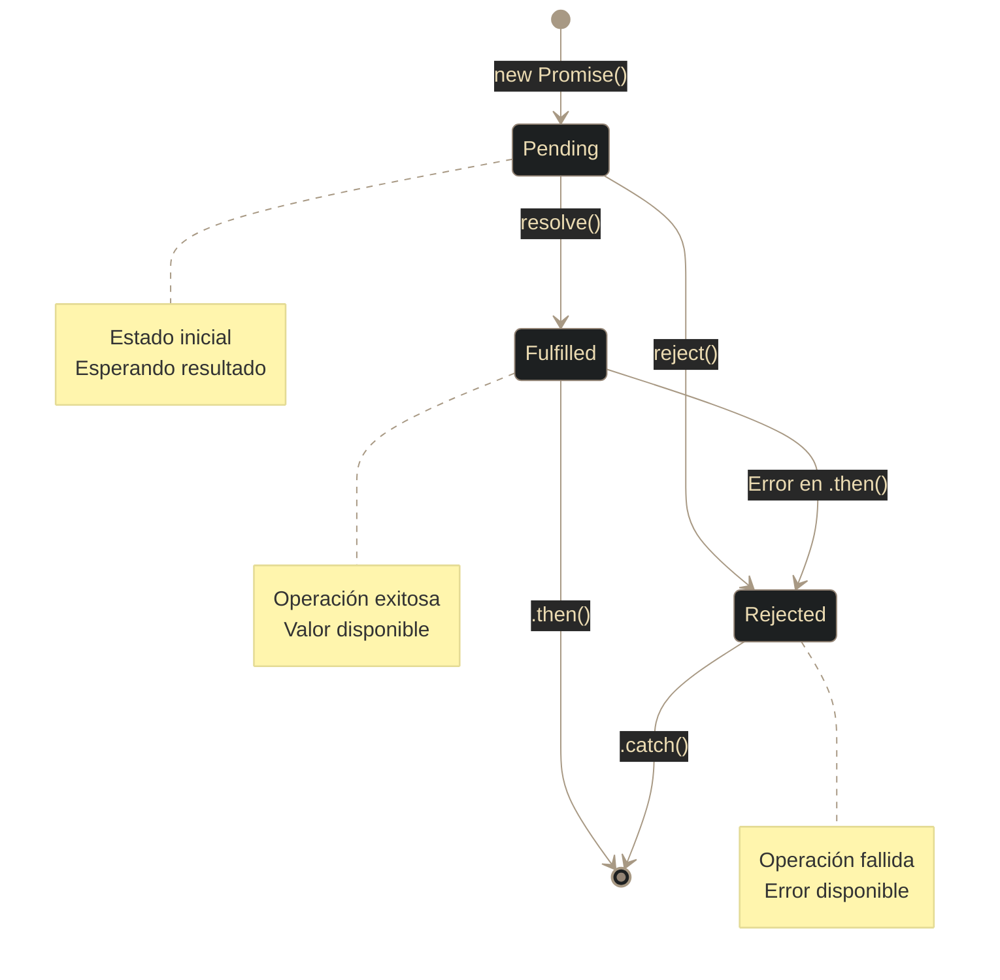
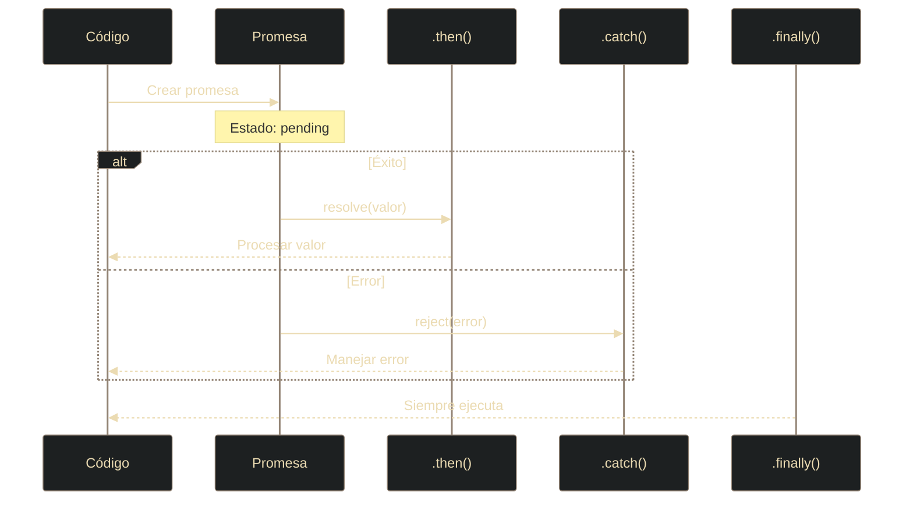

# JS - Promesas (Promises)

## Definición

Las Promesas son objetos que representan el **resultado eventual** (éxito o fracaso) de una operación asíncrona. Permiten escribir código asíncrono de forma más legible que los callbacks tradicionales, evitando el "callback hell".

## Explicación

- *Qué problema resuelve*
    Antes de ES6 (2015), las operaciones asíncronas usaban callbacks anidados, creando código difícil de leer ("callback hell"). Las promesas permiten encadenar operaciones de forma lineal y manejar errores centralizadamente.

- *Cómo funciona por arriba*
    - Una promesa tiene **tres estados**: pending → fulfilled o rejected
    - Se crea con `new Promise((resolve, reject) => {...})`
    - `.then()` maneja el éxito, `.catch()` el error, `.finally()` siempre se ejecuta
    - Los `.then()` se pueden encadenar; cada uno devuelve una nueva promesa
    - Los errores se propagan hacia abajo hasta encontrar un `.catch()`

- *Qué implica / qué permite*
    - Encadenar operaciones asíncronas sin anidación profunda
    - Manejo centralizado de errores
    - Combinar promesas: `Promise.all()`, `Promise.race()`
    - Usar async/await como azúcar sintáctico más legible

## Estados de una promesa

## Ciclo de vida

## Métodos estáticos

| Método | Descripción | Cuándo usar |
|--------|-------------|-------------|
| `Promise.all([p1, p2])` | Espera a que TODAS se cumplan | Paralelizar operaciones independientes |
| `Promise.race([p1, p2])` | Devuelve la primera en completarse | Timeouts, carreras de datos |
| `Promise.allSettled([p1, p2])` | Espera a que todas terminen | Cuando necesitas todos los resultados |
| `Promise.resolve(valor)` | Crea promesa ya resuelta | Testing o wrappers |
| `Promise.reject(error)` | Crea promesa ya rechazada | Testing o errores inmediatos |

## Async/Await

Azúcar sintáctico sobre promesas que permite escribir código asíncrono como si fuera síncrono.

**Características:**
- `async` declara una función que devuelve una promesa
- `await` pausa la ejecución hasta que la promesa se resuelva
- Manejo de errores con `try/catch` más natural
- Código más legible y mantenible

**Ventajas sobre .then():**
- Menos anidamiento
- Flujo más lineal
- Manejo de errores más intuitivo
- Facilita debugging

## Palabras clave

- Promise
- Pending / Fulfilled / Rejected
- Resolve / Reject
- Then / Catch / Finally
- Async / Await
- Callback hell
- Encadenamiento

## Comparaciones típicas

- vs [[18 - JS - Fetch API]]: fetch devuelve promesas; es el ejemplo más común
- vs Callbacks: promesas evitan anidamiento y permiten mejor manejo de errores
- vs código síncrono: promesas no bloquean el hilo principal

## Preguntas de examen

- ¿Cuáles son los tres estados de una promesa?
- ¿Qué diferencia hay entre `.then()` y `.catch()`?
- ¿Para qué sirve `Promise.all()`?
- ¿Qué es async/await y qué ventajas tiene?
- ¿Cómo se propagan los errores en promesas encadenadas?

## Errores comunes

- Olvidar retornar una promesa dentro de `.then()` al encadenar
- No usar `.catch()` (causa unhandled promise rejections)
- Pensar que código después de una promesa espera a que se resuelva
- Crear promesas innecesarias alrededor de funciones que ya devuelven promesas
- Usar async/await sin try/catch
- Confundir `Promise.all()` (todas) con `Promise.race()` (la primera)

## Mini-ejemplo (mental)

Una promesa es como **pedir una pizza por teléfono**: te dicen "estará en 30 minutos" (**pending**). Sigues haciendo otras cosas (asíncrono). Cuando llega (**fulfilled**), comes (`.then()`). Si se retrasa (**rejected**), te quejas (`.catch()`). De cualquier modo, al final recoges la mesa (`.finally()`).
