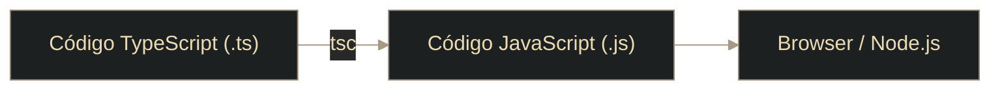

# TS - Introducción a TypeScript

## Definición

TypeScript (TS) es un **superconjunto de JavaScript** que agrega **tipado estático** y herramientas para escribir código más **robusto y mantenible**.

## Explicación

- *Qué problema resuelve*
    En proyectos medianos/grandes, JavaScript puede acumular errores de tipos que aparecen recién en ejecución. TypeScript detecta muchos de esos problemas **antes de correr el código**.

- *Cómo funciona por arriba*
    - Escribes `.ts` (TypeScript)
    - El compilador/transpilador `tsc` lo convierte a `.js` (JavaScript)
    - El `.js` resultante es lo que se ejecuta en navegador o Node.js
    - TS no “vive” en runtime: los tipos se usan para verificar durante desarrollo

- *Qué implica / qué permite*
    - Menos errores en ejecución (por verificación en compilación)
    - Mejor autocompletado y navegación en el IDE
    - Código más legible: los tipos actúan como documentación
    - Se puede adoptar gradualmente: JS válido suele ser TS válido

## Compilación rápida (idea)

## Palabras clave

- Superset (superconjunto)
- Tipado estático
- Transpilación
- `tsc`
- Compilación (compile-time)
- `--noEmitOnError`

## Comparaciones típicas

- vs [[31 - TS - Comparación entre JavaScript y TypeScript]]: TS agrega tipos y chequeo en compilación; JS corre directo sin ese chequeo.
- vs [[30 - TS - tsconfig.json]]: `tsconfig.json` define opciones de compilación para no repetir flags.
- vs [[32 - Node - Administración del Proyecto con npm]]: npm se usa para instalar TypeScript y documentar scripts de build.

## Preguntas de examen

- ¿Qué significa que TypeScript sea un “superconjunto” de JavaScript?
- ¿Por qué TypeScript no se ejecuta directamente en el navegador?
- ¿Qué hace el comando `tsc`?
- ¿Para qué sirve `--noEmitOnError`?
- ¿Qué ventaja aporta TypeScript al IDE?

## Errores comunes

- Pensar que el código `.ts` se ejecuta tal cual (siempre termina en `.js`).
- Usar `any` como salida rápida y perder las ventajas del tipado. Ver: [[06 - TS - Tipo any]]
- Creer que “tener TS” reemplaza las pruebas (reduce una clase de errores, pero no todos).

## Mini-ejemplo (mental)

TypeScript es como escribir con un corrector ortográfico que revisa reglas antes de publicar: no cambia el idioma final (se ejecuta JS), pero evita muchas “faltas” antes.

