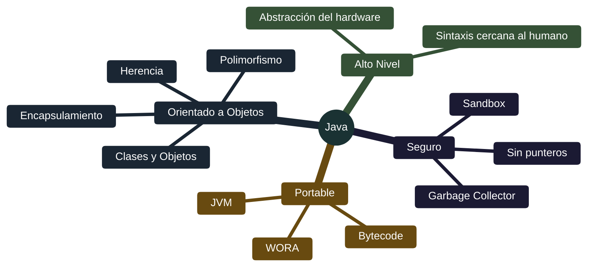

# Java - Introducción y características

## Definición

Java es un lenguaje de programación de **alto nivel**, **orientado a objetos** y diseñado para ser **portable y seguro**. Lanzado en 1995 por Sun Microsystems, se ha convertido en uno de los lenguajes más utilizados para desarrollo web, móvil y sistemas empresariales.

## Explicación

- *Qué problema resuelve*
    Java resuelve el problema de la portabilidad entre plataformas. Antes de Java, un programa compilado para Windows no funcionaba en Linux o Mac. Java permite "escribir una vez, ejecutar en cualquier lugar" (WORA - Write Once, Run Anywhere).

- *Cómo funciona por arriba*
    - Código fuente Java → Compilador (`javac`) → Bytecode
    - El bytecode es un formato intermedio no específico de plataforma
    - La **JVM** (Java Virtual Machine) interpreta el bytecode en cada sistema operativo
    - La JVM traduce a instrucciones nativas del hardware específico

- *Qué implica / qué permite*
    - Desarrollo multiplataforma sin recompilar
    - Gestión automática de memoria (garbage collector)
    - Seguridad mediante sandboxing
    - Amplia biblioteca de clases estándar

## Características principales

## Programación Orientada a Objetos (POO)

### Pilares de la POO en Java

| Concepto | Descripción |
|----------|-------------|
| **Clases y Objetos** | Clase = molde/plantilla. Objeto = instancia concreta |
| **Encapsulamiento** | Ocultar detalles internos. Modificadores: private, protected, public |
| **Herencia** | Clase hija adquiere atributos y métodos de clase padre |
| **Polimorfismo** | Un mismo método tiene diferentes comportamientos según el contexto |

## Proceso de ejecución

## Palabras clave

- Bytecode
- JVM (Java Virtual Machine)
- WORA (Write Once, Run Anywhere)
- POO (Programación Orientada a Objetos)
- Encapsulamiento
- Herencia
- Polimorfismo
- Garbage Collector

## Comparaciones típicas

- vs C/C++: Java es más portable (bytecode + JVM) y gestiona memoria automáticamente
- vs Python: Java es compilado a bytecode (más rápido), fuertemente tipado
- vs JavaScript: Java es compilado y tipado estáticamente; JS es interpretado y dinámico

## Preguntas de examen

- ¿Qué significa que Java sea "portable" y cómo lo logra?
- ¿Qué es el bytecode y qué ventaja tiene sobre código máquina?
- ¿Cuáles son los cuatro pilares de la POO en Java?
- ¿Qué es la JVM y cuál es su función?
- ¿Qué significa WORA?

## Errores comunes

- Pensar que Java es un lenguaje interpretado puro (es compilado a bytecode y luego interpretado/JIT)
- Confundir clase con objeto (clase es el molde, objeto es la instancia)
- Creer que Java es 100% orientado a objetos (tiene tipos primitivos)
- No entender que la JVM es diferente en cada sistema operativo

## Mini-ejemplo (mental)

Java es como **un traductor universal**: escribes un libro en un idioma neutral (código Java), un compilador lo traduce a un código intermedio universal (bytecode), y luego cada país tiene su propio intérprete (JVM) que lo traduce a su idioma local (código máquina). Así el mismo libro puede leerse en cualquier parte del mundo sin reescribirlo.
