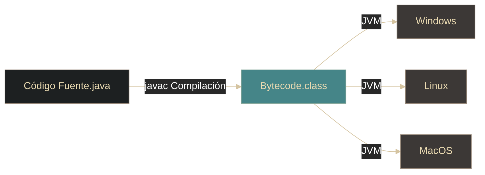

# Java - Introducción y características

## Definición

Java es un lenguaje **orientado a objetos** y **portable**: se compila a bytecode y se ejecuta en una JVM, lo que permite correr en múltiples plataformas.

## Explicación

- *Qué problema resuelve*
    Resuelve la portabilidad entre sistemas operativos y mejora la robustez al detectar muchos errores en compilación.

- *Cómo funciona por arriba*
    - Código fuente `.java` → `javac` → bytecode `.class`
    - La JVM ejecuta ese bytecode (interpretación/JIT) en cada plataforma

- *Qué implica / qué permite*
    - Multiplataforma (WORA: Write Once, Run Anywhere)
    - Tipado estático (errores antes de ejecutar)
    - Garbage Collector (memoria automática)
    - Biblioteca estándar grande (`java.util`, `java.io`, etc.)

## Proceso de ejecución

## Palabras clave

- Bytecode
- JVM (Java Virtual Machine)
- WORA (Write Once, Run Anywhere)
- Garbage Collector

## Comparaciones típicas

- vs JavaScript: Java es tipado estáticamente (compile-time); JS es dinámico (runtime).
- vs C/C++: Java gestiona memoria automáticamente y busca portabilidad vía JVM.

## Preguntas de examen

- ¿Qué significa que Java sea "portable" y cómo lo logra?
- ¿Qué es el bytecode y qué ventaja tiene sobre código máquina?
- ¿Cuáles son los cuatro pilares de la POO en Java?
- ¿Qué es la JVM y cuál es su función?
- ¿Qué significa WORA?

## Errores comunes

- Pensar que Java es un lenguaje interpretado puro (es compilado a bytecode y luego interpretado/JIT)
- Confundir clase con objeto (clase es el molde, objeto es la instancia)
- Creer que Java es 100% orientado a objetos (tiene tipos primitivos)
- No entender que la JVM es diferente en cada sistema operativo

## Mini-ejemplo (mental)

Java es como **un traductor universal**: escribes un libro en un idioma neutral (código Java), un compilador lo traduce a un código intermedio universal (bytecode), y luego cada país tiene su propio intérprete (JVM) que lo traduce a su idioma local (código máquina). Así el mismo libro puede leerse en cualquier parte del mundo sin reescribirlo.
