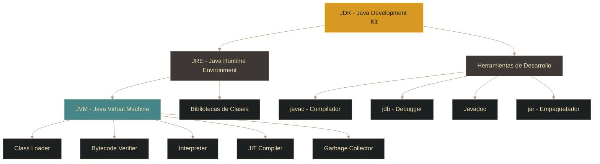
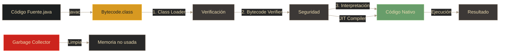

# Java - JDK y JVM

## Definición

El **JDK** (Java Development Kit) es el paquete de herramientas necesario para desarrollar aplicaciones Java. Incluye el compilador, la JVM, bibliotecas y herramientas de desarrollo. La **JVM** (Java Virtual Machine) es el componente que ejecuta el bytecode Java en cualquier plataforma.

## Explicación

- *Qué problema resuelve*
    El JDK proporciona todo lo necesario para compilar y ejecutar código Java. La JVM resuelve el problema de la portabilidad al ser la capa de abstracción entre el bytecode y el sistema operativo/hardware subyacente.

- *Cómo funciona por arriba*
    - **JDK**: Contiene javac (compilador), JVM (ejecutor), bibliotecas estándar y herramientas
    - **JVM**: Carga bytecode, verifica seguridad, interpreta/compila a código nativo (JIT), gestiona memoria
    - El bytecode es independiente de la plataforma; la JVM es específica de cada sistema

- *Qué implica / qué permite*
    - Desarrollo completo con una sola instalación (JDK)
    - Ejecución en cualquier plataforma con JVM instalada
    - Optimizaciones en tiempo de ejecución (JIT compilation)
    - Gestión automática de memoria (Garbage Collection)

## Arquitectura JDK

## Componentes principales del JDK

| Componente | Función | Ejemplo de uso |
|------------|---------|----------------|
| **javac** | Compilador: .java → .class | `javac MiPrograma.java` |
| **JVM** | Ejecuta bytecode | `java MiPrograma` |
| **Bibliotecas** | Clases predefinidas (java.io, java.util, etc.) | Importar y usar |
| **JDB** | Debugger | Depurar código |
| **Javadoc** | Genera documentación HTML | `javadoc MiClase.java` |
| **JAR** | Empaqueta clases y recursos | `jar cvf app.jar *.class` |

## Funcionamiento de la JVM

### Etapas de la JVM

1. **Class Loader**: Carga las clases en memoria
2. **Bytecode Verifier**: Verifica seguridad y validez del bytecode
3. **Interpreter**: Ejecuta bytecode línea por línea
4. **JIT Compiler** (Just-In-Time): Compila bytecode a código nativo para optimizar ejecución frecuente
5. **Garbage Collector**: Libera memoria de objetos no utilizados

## JRE vs JDK

| Aspecto | JRE | JDK |
|---------|-----|-----|
| **Significado** | Java Runtime Environment | Java Development Kit |
| **Contiene** | JVM + Bibliotecas | JRE + Herramientas de desarrollo |
| **Para** | Ejecutar programas Java | Desarrollar programas Java |
| **Incluye compilador** | ❌ No | ✅ Sí (javac) |
| **Incluye debugger** | ❌ No | ✅ Sí (jdb) |

> **Relación**: JDK = JRE + Herramientas de desarrollo

## Palabras clave

- JDK (Java Development Kit)
- JRE (Java Runtime Environment)
- JVM (Java Virtual Machine)
- javac (compilador)
- Bytecode
- JIT Compiler
- Garbage Collector
- Class Loader

## Comparaciones típicas

- vs [[01 - Java - Introducción y características]]: JDK es el kit completo; JVM es el componente de ejecución
- vs otros lenguajes: JDK incluye todo en un solo paquete; otros lenguajes suelen separar runtime de development tools

## Preguntas de examen

- ¿Cuál es la diferencia entre JDK, JRE y JVM?
- ¿Qué componente del JDK convierte .java a .class?
- ¿Qué es el JIT Compiler y para qué sirve?
- ¿Qué hace el Garbage Collector?
- ¿Para qué sirve el Bytecode Verifier?

## Errores comunes

- Confundir JDK con JRE (JRE solo ejecuta, JDK también compila)
- Pensar que la JVM interpreta siempre todo (usa JIT para optimizar código frecuente)
- No entender que necesitas JDK para desarrollar, pero JRE es suficiente para ejecutar
- Creer que el Garbage Collector elimina inmediatamente objetos (es asíncrono)

## Mini-ejemplo (mental)

El **JDK es como un kit de carpintería completo**: incluye herramientas para cortar (javac), lijar (debugger), y el manual (javadoc). La **JVM es como el taller**: es donde realmente se construye y ensambla (ejecuta). El **bytecode son los planos universales**: cualquier taller (JVM) en cualquier ciudad (sistema operativo) puede seguirlos para construir el mismo mueble (programa).
