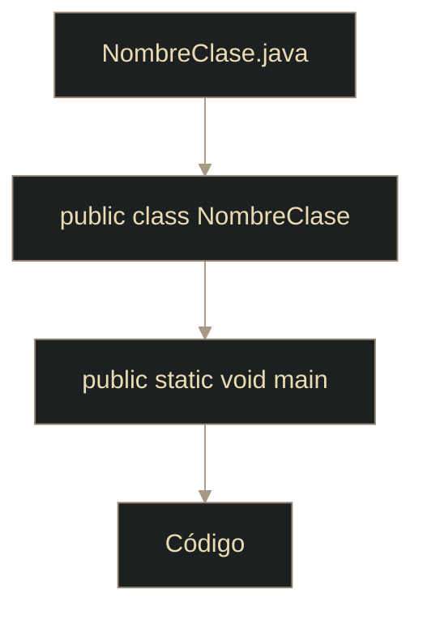

# Java - Sintaxis básica

## Definición

La sintaxis de Java es el conjunto de reglas para escribir código válido y legible.

## Explicación

- *Qué problema resuelve*
    Define una estructura común para que el compilador y otros programadores entiendan el código.

- *Cómo funciona por arriba*
    - Todo programa va dentro de una clase
    - El punto de entrada es `main`
    - Las sentencias terminan con `;`
    - Los bloques usan `{}`

- *Qué implica / qué permite*
    - Menos ambigüedad
    - Errores detectados en compilación
    - Código más mantenible

## Estructura mínima

## Reglas rápidas

- Java distingue mayúsculas y minúsculas
- El nombre de la clase pública debe coincidir con el archivo
- Usar convenciones: `CamelCase` en clases y `camelCase` en métodos/variables

## Palabras clave

- Clase
- `main`
- `;`
- `{}`
- Case-sensitive
- Convenciones de nombres

## Comparaciones típicas

- vs [[01 - Java - Introducción y características]]: esta nota baja a reglas concretas de escritura
- vs JavaScript: Java exige estructura de clase/método para arrancar

## Preguntas de examen

- ¿Cuál es el punto de entrada de un programa Java?
- ¿Por qué importa que el archivo coincida con la clase pública?
- ¿Qué diferencia hay entre `CamelCase` y `camelCase`?

## Errores comunes

- Olvidar `;`
- Romper mayúsculas/minúsculas en nombres
- Nombrar mal el archivo respecto de la clase pública

## Mini-ejemplo (mental)

La sintaxis es como la gramática: si rompes reglas básicas, el "corrector" (compilador) no te deja avanzar.
