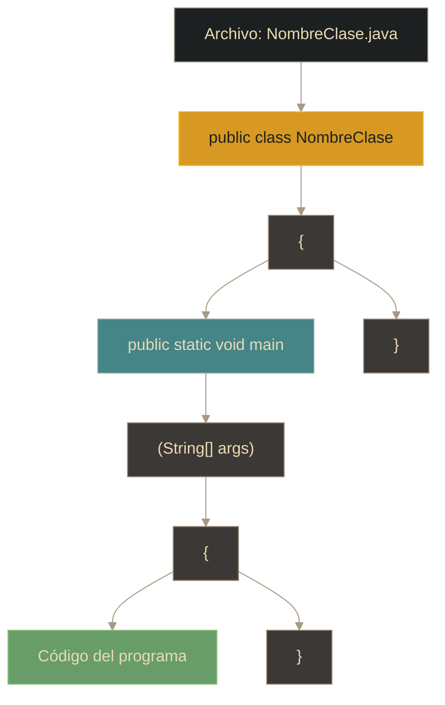
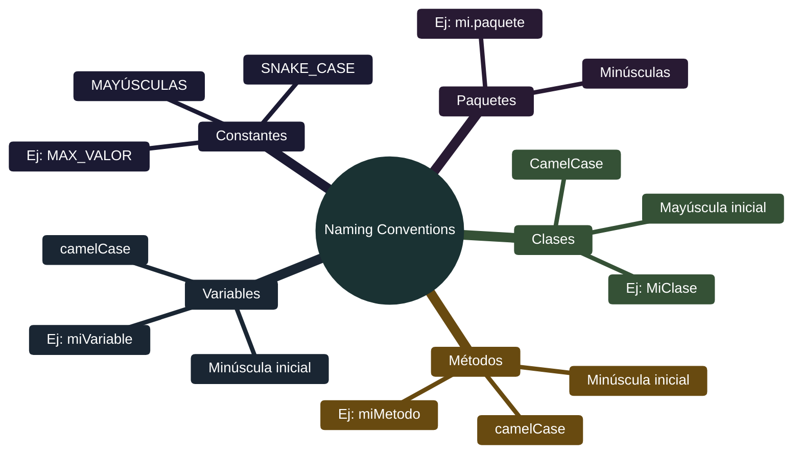

# Java - Sintaxis básica

## Definición

La sintaxis de Java define las reglas y convenciones para escribir código válido. Está basada en C/C++ pero simplificada, con una estructura clara que facilita la lectura y mantenimiento del código.

## Explicación

- *Qué problema resuelve*
    Proporciona una estructura uniforme y predecible para escribir programas. Las reglas estrictas evitan errores comunes y facilitan que diferentes programadores entiendan el código.

- *Cómo funciona por arriba*
    - Todo código Java pertenece a una **clase**
    - El punto de entrada es el método `main`
    - Las instrucciones terminan con `;`
    - Los bloques se delimitan con `{}`
    - Java distingue mayúsculas y minúsculas

- *Qué implica / qué permite*
    - Organización estructurada del código
    - Validación de errores en tiempo de compilación
    - Convenciones de nombres para mejor legibilidad
    - Comentarios para documentación

## Estructura mínima de un programa

## Reglas fundamentales

| Regla | Descripción | Ejemplo |
|-------|-------------|---------|
| **Archivos** | `.java` para fuente, `.class` para bytecode | `MiClase.java` |
| **Punto y coma** | Cada instrucción termina con `;` | `int x = 5;` |
| **Llaves** | Bloques delimitados por `{}` | `if (true) { ... }` |
| **Case-sensitive** | Distingue mayúsculas/minúsculas | `MiVariable` ≠ `mivariable` |
| **Nombre de archivo** | Debe coincidir con el nombre de clase pública | `class Hola` → `Hola.java` |

## Convenciones de nombres

## Palabras reservadas

Java tiene palabras clave con significado especial que **no pueden usarse** como identificadores:

| Categoría | Palabras |
|-----------|----------|
| **Modificadores** | public, private, protected, static, final, abstract |
| **Tipos** | class, interface, enum, byte, short, int, long, float, double, char, boolean, void |
| **Control** | if, else, switch, case, default, while, do, for, break, continue, return |
| **Excepciones** | try, catch, finally, throw, throws |
| **Otros** | new, this, super, extends, implements, import, package, instanceof, null, true, false |

## Comentarios

| Tipo | Sintaxis | Uso |
|------|----------|-----|
| **Línea simple** | `// Comentario` | Explicar una línea |
| **Múltiples líneas** | `/* ... */` | Bloques de comentarios |
| **Documentación** | `/** ... */` | Javadoc (genera documentación HTML) |

## Proceso de compilación y ejecución

**Pasos:**
1. Escribir código en archivo `.java`
2. Compilar: `javac NombreClase.java` → genera `.class`
3. Ejecutar: `java NombreClase` (sin extensión)

## Palabras clave

- Clase (class)
- Método main
- public / static / void
- CamelCase
- Case-sensitive
- Identificadores
- Palabras reservadas
- Compilación
- Bytecode

## Comparaciones típicas

- vs [[01 - Java - Introducción y características]]: sintaxis es la implementación práctica de las características del lenguaje
- vs otros lenguajes: Java requiere clase y método main; Python o JavaScript pueden ejecutar código directamente

## Preguntas de examen

- ¿Cuál es el método de entrada (punto de inicio) de un programa Java?
- ¿Por qué el nombre del archivo debe coincidir con el nombre de la clase pública?
- ¿Qué diferencia hay entre CamelCase y camelCase?
- ¿Cuándo usar `//` vs `/* */` vs `/** */`?
- ¿Java distingue mayúsculas de minúsculas?

## Errores comunes

- Olvidar el punto y coma al final de instrucciones
- Confundir mayúsculas y minúsculas en nombres
- Nombrar el archivo diferente a la clase pública
- Intentar usar palabras reservadas como identificadores
- Usar `java MiClase.class` en lugar de `java MiClase`

## Mini-ejemplo (mental)

La sintaxis de Java es como **la gramática de un idioma**: tiene reglas estrictas de puntuación (punto y coma), estructura (llaves), y capitalización. Si escribes mal una carta (código), el corrector (compilador) te lo devuelve para que lo arregles antes de enviarla (ejecutar).
