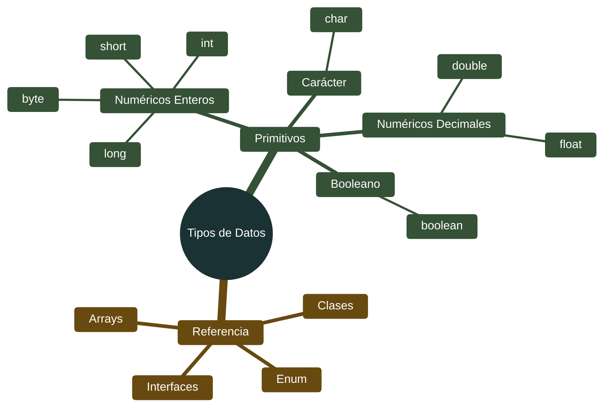
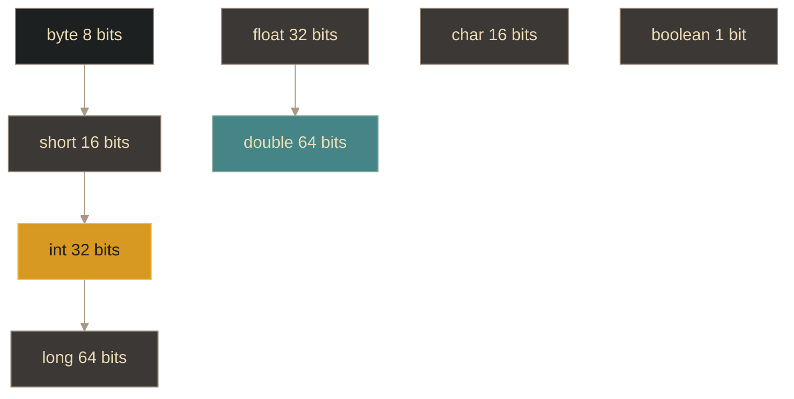

# Java - Tipos de datos

## Definición

Los tipos de datos en Java definen qué valores puede almacenar una variable y qué operaciones se pueden realizar con ella. Java es un lenguaje **fuertemente tipado**, lo que significa que cada variable debe declararse con un tipo específico.

## Explicación

- *Qué problema resuelve*
    Garantiza la integridad de los datos y permite detectar errores en tiempo de compilación. Al especificar tipos, el compilador puede verificar que las operaciones sean válidas y asignar la memoria adecuada.

- *Cómo funciona por arriba*
    - **Tipos primitivos**: Almacenan valores directamente en memoria (stack)
    - **Tipos de referencia**: Almacenan direcciones de memoria donde están los objetos (heap)
    - Cada tipo tiene un tamaño y rango específico
    - Java maneja automáticamente la conversión entre tipos compatibles

- *Qué implica / qué permite*
    - Seguridad de tipos en tiempo de compilación
    - Optimización de memoria según el tipo
    - Operaciones específicas para cada tipo de dato
    - Conversión entre tipos (casting)

## Categorías de tipos

## Tipos primitivos numéricos enteros

| Tipo | Tamaño | Rango | Uso típico |
|------|--------|-------|------------|
| **byte** | 8 bits | -128 a 127 | Ahorro de memoria, datos en crudo |
| **short** | 16 bits | -32,768 a 32,767 | Compatibilidad, ahorro memoria |
| **int** | 32 bits | -2,147,483,648 a 2,147,483,647 | Enteros por defecto |
| **long** | 64 bits | -9,223,372,036,854,775,808 a 9,223,372,036,854,775,807 | Valores muy grandes |

> **Nota**: Los literales `long` terminan con `L` (ej: `123456789L`)

## Tipos primitivos numéricos decimales

| Tipo | Tamaño | Precisión | Uso típico |
|------|--------|-----------|------------|
| **float** | 32 bits | ~6-7 decimales | Ahorro memoria, precisión limitada |
| **double** | 64 bits | ~15-16 decimales | Decimales por defecto, mayor precisión |

> **Nota**: Los literales `float` terminan con `f` (ej: `3.14f`). Los `double` pueden terminar con `d` o sin nada.

## Otros tipos primitivos

| Tipo | Tamaño | Valores | Descripción |
|------|--------|---------|-------------|
| **char** | 16 bits | Un solo carácter Unicode | `'A'`, `'ñ'`, `'7'` |
| **boolean** | 1 bit | `true` o `false` | Valores lógicos |

## Jerarquía de tipos numéricos

## Tipos de referencia

| Tipo | Descripción | Ejemplos |
|------|-------------|----------|
| **Clases** | Definidas por el usuario o API | `String`, `Scanner`, clases propias |
| **Interfaces** | Contratos de comportamiento | `List`, `Map`, `Runnable` |
| **Arrays** | Colecciones de elementos | `int[]`, `String[]` |
| **Enum** | Conjunto de constantes nombradas | `DiaSemana`, `Estado` |

## Diferencias: Primitivos vs Referencia

| Característica | Primitivos | Referencia |
|----------------|------------|------------|
| **Almacenamiento** | Stack (valor directo) | Heap (referencia/memoria) |
| **Valores por defecto** | Sí (0, false, etc.) | null |
| **Métodos** | No tienen métodos | Tienen métodos |
| **Generics** | No se pueden usar | Sí se pueden usar |
| **Comparación con ==** | Compara valores | Compara referencias (direcciones) |

## Palabras clave

- Tipos primitivos
- Tipos de referencia
- byte, short, int, long
- float, double
- char, boolean
- String
- Casting
- Stack vs Heap

## Comparaciones típicas

- vs [[03 - Java - Sintaxis básica]]: los tipos de datos son los bloques de construcción de la sintaxis
- vs otros lenguajes: Java tiene tipos primitivos y wrappers; lenguajes como Python solo tienen tipos de referencia

## Preguntas de examen

- ¿Cuál es la diferencia entre tipos primitivos y tipos de referencia?
- ¿Cuántos bits ocupa un `int` y qué rango tiene?
- ¿Por qué usar `double` en lugar de `float`?
- ¿Qué valor por defecto tienen las variables primitivas vs las de referencia?
- ¿Dónde se almacenan los tipos primitivos (stack o heap)?

## Errores comunes

- Pensar que `String` es un tipo primitivo (es una clase/objeto)
- No usar sufijo `L` para literales long grandes (puede causar overflow)
- No usar sufijo `f` para literales float
- Comparar objetos con `==` en lugar de `.equals()`
- Olvidar que `char` usa comillas simples (`'A'`) y `String` usa dobles (`"A"`)

## Mini-ejemplo (mental)

Los tipos de datos son como **diferentes tamaños de cajas**: `byte` es una cajita pequeña para guardar solo números chicos (-128 a 127), `int` es una caja mediana estándar, y `long` es un contenedor gigante para números enormes. Cada caja tiene su etiqueta (tipo) y solo puedes guardar cosas que quepan en ella. Las cajas primitivas guardan el valor directamente; las de referencia guardan la dirección donde está el objeto real (como guardar la dirección de una bodega en lugar de la bodega misma).
