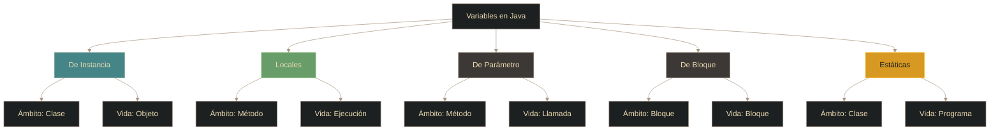
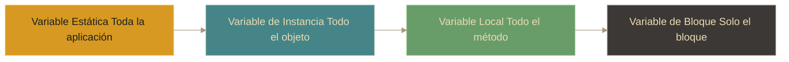

# Java - Variables y ámbito

## Definición

Las **variables** son espacios de memoria con nombre que almacenan datos. El **ámbito** (scope) define dónde en el código una variable es visible y puede utilizarse.

## Explicación

- *Qué problema resuelve*
    Permite almacenar y manipular datos en el programa. El ámbito controla la visibilidad y ciclo de vida de las variables, evitando conflictos de nombres y gestionando eficientemente la memoria.

- *Cómo funciona por arriba*
    - Variables se declaran con un tipo y nombre
    - El ámbito determina dónde pueden usarse
    - Variables locales se destruyen al salir del bloque
    - Variables de instancia pertenecen a objetos
    - Variables estáticas pertenecen a la clase

- *Qué implica / qué permite*
    - Reutilización de nombres en diferentes ámbitos
    - Encapsulación de datos
    - Gestión automática de memoria según alcance
    - Diferentes duraciones según el tipo de variable

## Tipos de variables según ámbito

## Variables de instancia (atributos)

- **Ámbito**: Toda la clase
- **Vida**: Mientras exista el objeto
- **Inicialización**: Automática (0, false, null)
- **Acceso**: A través del objeto

## Variables locales

- **Ámbito**: Dentro del método donde se declaran
- **Vida**: Durante la ejecución del método
- **Inicialización**: Obligatoria manual
- **Acceso**: Solo dentro del método

## Variables de parámetro

- **Ámbito**: Dentro del método
- **Vida**: Durante la llamada al método
- **Uso**: Recibir datos al invocar el método
- **Son finales (final) implícitamente en versiones modernas**

## Variables de bloque

- **Ámbito**: Dentro del bloque `{}` donde se declaran
- **Vida**: Durante la ejecución del bloque
- **Uso común**: Bucles (`for`, `while`), condicionales

## Variables estáticas (de clase)

- **Ámbito**: Toda la clase
- **Vida**: Durante toda la ejecución del programa
- **Compartidas**: Entre todas las instancias de la clase
- **Acceso**: A través de la clase (no necesita objeto)

## Jerarquía de visibilidad

## Comparativa de inicialización

| Tipo de Variable | Inicialización automática | Valor por defecto |
|------------------|---------------------------|-------------------|
| **De instancia** | ✅ Sí | 0 (numéricos), false (boolean), null (referencias) |
| **Estáticas** | ✅ Sí | Igual que instancia |
| **Locales** | ❌ No | No tiene valor hasta asignar |
| **Parámetros** | ❌ No | Recibe valor al llamar |

## Palabras clave

- Variable de instancia / atributo
- Variable local
- Variable de parámetro
- Variable de bloque
- Variable estática / de clase
- Ámbito (scope)
- Ciclo de vida
- Inicialización

## Comparaciones típicas

- vs [[04 - Java - Tipos de datos]]: las variables son contenedores que usan tipos de datos
- vs [[02 - Java - JDK y JVM]]: el scope afecta dónde se almacenan (stack vs heap)

## Preguntas de examen

- ¿Cuál es la diferencia entre una variable de instancia y una variable local?
- ¿Las variables locales se inicializan automáticamente?
- ¿Qué tipo de variable se comparte entre todas las instancias de una clase?
- ¿Cuál es el ámbito de una variable declarada dentro de un bucle `for`?
- ¿Cuándo se destruye una variable local?

## Errores comunes

- Usar una variable local sin inicializarla
- Intentar acceder a una variable local fuera de su método
- Confundir variables de instancia con estáticas
- Crear variables con el mismo nombre en ámbitos que se solapan
- Pensar que una variable de bloque sobrevive al bloque

## Mini-ejemplo (mental)

Las variables son como **alcancías con diferentes visibilidades**: una **alcancía de clase** (estática) está en la sala de estar y todos la ven; una **alcancía personal** (instancia) está en tu cuarto y solo tú la usas; una **alcancía temporal** (local) está sobre la mesa mientras cuentas y luego desaparece; y una **alcancía de bloque** es solo para contar monedas específicas dentro de un juego.
