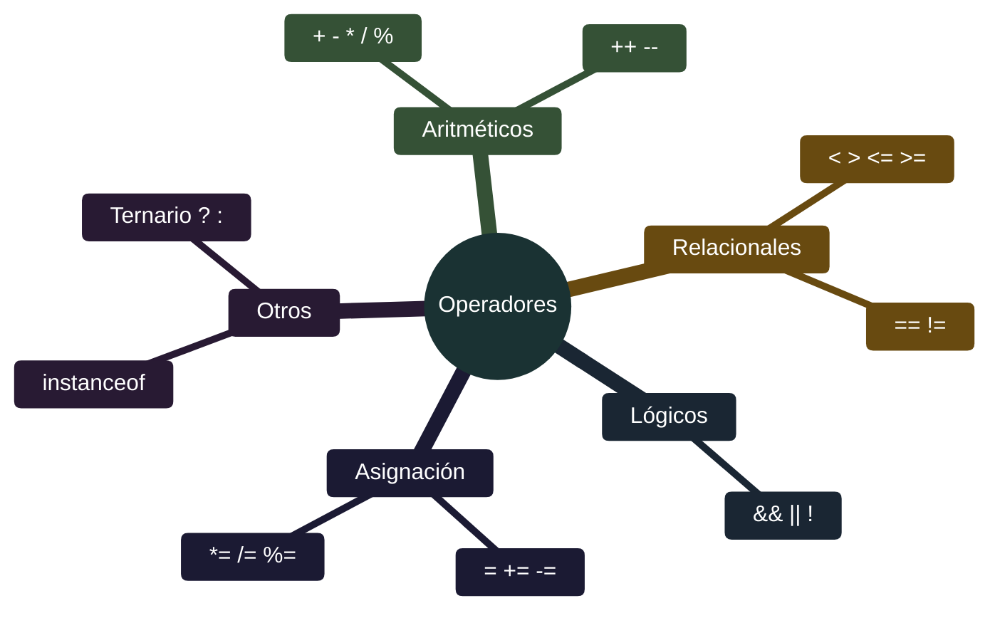

# Java - Operadores

## Definición

Los operadores son símbolos que realizan operaciones sobre operandos (variables, valores, expresiones). Java proporciona operadores aritméticos, relacionales, lógicos, de asignación y más.

## Explicación

- *Qué problema resuelve*
    Permite realizar cálculos matemáticos, comparaciones, asignaciones y operaciones lógicas fundamentales para cualquier programa.

- *Cómo funciona por arriba*
    - Los operadores toman uno o dos operandos
    - Realizan la operación definida
    - Devuelven un resultado del tipo correspondiente
    - Precedencia determina orden de evaluación

- *Qué implica / qué permite*
    - Expresiones matemáticas complejas
    - Toma de decisiones (comparaciones)
    - Control de flujo (operadores lógicos)
    - Asignaciones eficientes

## Categorías de operadores

## Reglas rápidas

- `=` asigna, `==` compara
- `/` entre enteros trunca (ej: `5/2` = `2`)
- `&&` y `||` cortocircuitan (a veces evita `NullPointerException`)
- Si hay dudas de precedencia, usar paréntesis

## Palabras clave

- Operadores aritméticos
- Operadores relacionales
- Operadores lógicos
- Operadores de asignación
- Precedencia
- Cortocircuito
- Incremento/decremento

## Comparaciones típicas

- vs [[04 - Java - Tipos de datos]]: los operadores trabajan sobre tipos de datos
- vs [[07 - Java - Estructuras de control]]: operadores relacionales y lógicos se usan en condiciones

## Preguntas de examen

- ¿Cuál es la diferencia entre `=` y `==`?
- ¿Qué hace el operador `%` (módulo)?
- ¿Qué es el cortocircuito en operadores lógicos?
- ¿Cuál es la precedencia: `&&` o `||`?
- ¿Qué diferencia hay entre `++x` y `x++`?

## Errores comunes

- Usar `=` en lugar de `==` en comparaciones
- No considerar precedencia (usar paréntesis para claridad)
- Dividir enteros esperando decimales (`5/2` = 2, no 2.5)
- Olvidar que `&&` tiene precedencia sobre `||`
- No usar cortocircuito a favor (ej: verificar null antes de usar)

## Mini-ejemplo (mental)

Los operadores son como **herramientas de una calculadora**: `+ - * /` son las básicas; `%` te dice cuánto sobra de una división; `&& || !` son interruptores lógicos que combinan condiciones; `++ --` son atajos para sumar/restar 1 rápidamente. La **precedencia** es como el orden de operaciones en matemáticas: paréntesis primero, luego multiplicación, luego suma.
