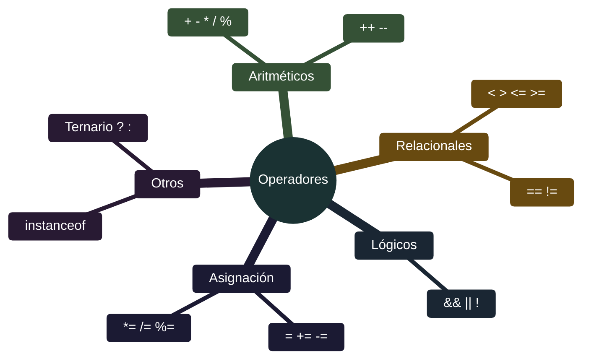

# Java - Operadores

## Definición

Los operadores son símbolos que realizan operaciones sobre operandos (variables, valores, expresiones). Java proporciona operadores aritméticos, relacionales, lógicos, de asignación y más.

## Explicación

- *Qué problema resuelve*
    Permite realizar cálculos matemáticos, comparaciones, asignaciones y operaciones lógicas fundamentales para cualquier programa.

- *Cómo funciona por arriba*
    - Los operadores toman uno o dos operandos
    - Realizan la operación definida
    - Devuelven un resultado del tipo correspondiente
    - Precedencia determina orden de evaluación

- *Qué implica / qué permite*
    - Expresiones matemáticas complejas
    - Toma de decisiones (comparaciones)
    - Control de flujo (operadores lógicos)
    - Asignaciones eficientes

## Categorías de operadores



## Operadores aritméticos

| Operador | Descripción | Ejemplo | Resultado |
|----------|-------------|---------|-----------|
| `+` | Suma | `5 + 3` | `8` |
| `-` | Resta | `5 - 3` | `2` |
| `*` | Multiplicación | `5 * 3` | `15` |
| `/` | División | `5 / 3` | `1` (enteros) |
| `%` | Módulo (resto) | `5 % 3` | `2` |

### Incremento/Decremento

| Operador | Descripción | Ejemplo |
|----------|-------------|---------|
| `++` | Incremento en 1 | `x++` o `++x` |
| `--` | Decremento en 1 | `x--` o `--x` |

> **Pre vs Post**: `++x` incrementa antes de usar; `x++` usa y luego incrementa

## Operadores relacionales

| Operador | Significado | Ejemplo |
|----------|-------------|---------|
| `==` | Igual a | `a == b` |
| `!=` | Distinto de | `a != b` |
| `<` | Menor que | `a < b` |
| `>` | Mayor que | `a > b` |
| `<=` | Menor o igual | `a <= b` |
| `>=` | Mayor o igual | `a >= b` |

> ⚠️ `=` es asignación; `==` es comparación

## Operadores lógicos

| Operador | Descripción | Uso |
|----------|-------------|-----|
| `&&` | AND (y) | `a && b` - true si ambos son true |
| `\|\|` | OR (o) | `a \|\| b` - true si al menos uno es true |
| `!` | NOT (negación) | `!a` - invierte el valor |

### Cortocircuito

- `&&`: Si el primero es false, no evalúa el segundo
- `||`: Si el primero es true, no evalúa el segundo

## Operadores de asignación

| Operador | Equivalente | Descripción |
|----------|-------------|-------------|
| `=` | `a = b` | Asigna valor |
| `+=` | `a = a + b` | Suma y asigna |
| `-=` | `a = a - b` | Resta y asigna |
| `*=` | `a = a * b` | Multiplica y asigna |
| `/=` | `a = a / b` | Divide y asigna |
| `%=` | `a = a % b` | Módulo y asigna |

## Precedencia de operadores

```mermaid
%%{init: {'theme': 'base', 'themeVariables': { 'primaryColor': '#1d2021', 'primaryTextColor': '#ebdbb2', 'primaryBorderColor': '#928374', 'lineColor': '#a89984', 'secondaryColor': '#282828', 'tertiaryColor': '#3c3836'}}}%%
graph TD
    A[Precedencia<br/>Mayor a menor]
    A --> B[() Paréntesis]
    B --> C[++ -- !]
    C --> D[* / %]
    D --> E[+ -]
    E --> F[< <= > >=]
    F --> G[== !=]
    G --> H[&&]
    H --> I[||]
    I --> J[= += -= etc]
    
    style A fill:#1d2021,stroke:#928374,color:#ebdbb2
    style B fill:#d79921,stroke:#fabd2f,color:#1d2021
    style C fill:#458588,stroke:#83a598,color:#ebdbb2
    style D fill:#689d6a,stroke:#8ec07c,color:#ebdbb2
    style E fill:#3c3836,stroke:#928374,color:#ebdbb2
    style F fill:#3c3836,stroke:#928374,color:#ebdbb2
    style G fill:#3c3836,stroke:#928374,color:#ebdbb2
    style H fill:#3c3836,stroke:#928374,color:#ebdbb2
    style I fill:#3c3836,stroke:#928374,color:#ebdbb2
    style J fill:#cc241d,stroke:#fb4934,color:#ebdbb2
```

## Palabras clave

- Operadores aritméticos
- Operadores relacionales
- Operadores lógicos
- Operadores de asignación
- Precedencia
- Cortocircuito
- Incremento/decremento

## Comparaciones típicas

- vs [[04 - Java - Tipos de datos]]: los operadores trabajan sobre tipos de datos
- vs [[07 - Java - Estructuras de control]]: operadores relacionales y lógicos se usan en condiciones

## Preguntas de examen

- ¿Cuál es la diferencia entre `=` y `==`?
- ¿Qué hace el operador `%` (módulo)?
- ¿Qué es el cortocircuito en operadores lógicos?
- ¿Cuál es la precedencia: `&&` o `||`?
- ¿Qué diferencia hay entre `++x` y `x++`?

## Errores comunes

- Usar `=` en lugar de `==` en comparaciones
- No considerar precedencia (usar paréntesis para claridad)
- Dividir enteros esperando decimales (`5/2` = 2, no 2.5)
- Olvidar que `&&` tiene precedencia sobre `||`
- No usar cortocircuito a favor (ej: verificar null antes de usar)

## Mini-ejemplo (mental)

Los operadores son como **herramientas de una calculadora**: `+ - * /` son las básicas; `%` te dice cuánto sobra de una división; `&& || !` son interruptores lógicos que combinan condiciones; `++ --` son atajos para sumar/restar 1 rápidamente. La **precedencia** es como el orden de operaciones en matemáticas: paréntesis primero, luego multiplicación, luego suma.
