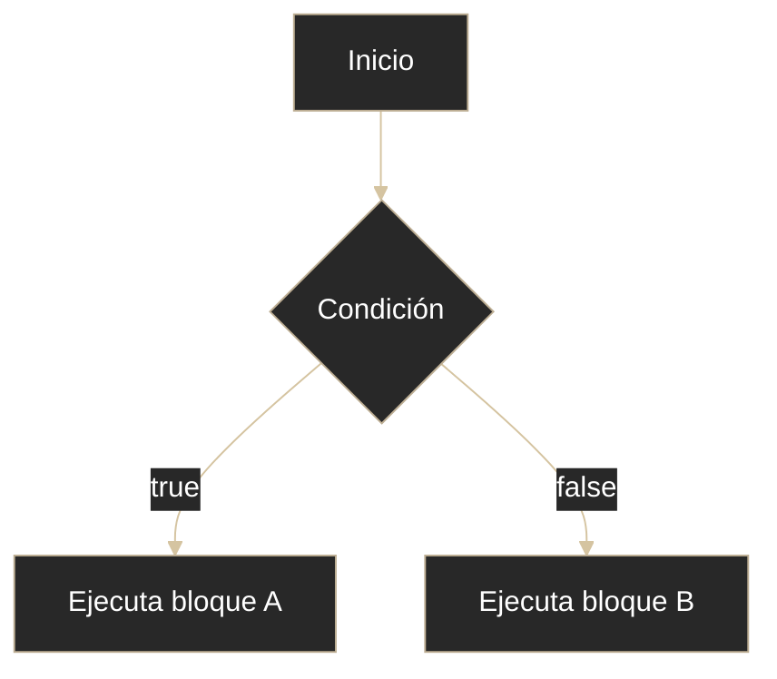

# Java - Estructuras de control

## Definición

Las estructuras de control deciden cómo avanza el programa: por condición, por repetición o por salto.

## Explicación

- *Qué problema resuelve*
    Permiten tomar decisiones y repetir tareas en lugar de ejecutar todo en línea recta.

- *Cómo funciona por arriba*
    - Condicionales: `if`, `switch`
    - Bucles: `for`, `while`, `do-while`, `for-each`
    - Saltos: `break`, `continue`, `return`

- *Qué implica / qué permite*
    - Lógica de negocio expresiva
    - Automatizar procesos repetitivos
    - Cortar o continuar flujo cuando hace falta

## Flujo condicional básico

## Regla rápida de elección

- `for`: cuando ya conocés cuántas iteraciones habrá
- `while`: cuando depende de una condición
- `do-while`: cuando debe ejecutarse al menos una vez
- `for-each`: para recorrer arrays/colecciones sin índice

## Palabras clave

- if
- switch
- for
- while
- do-while
- break / continue / return

## Comparaciones típicas

- vs [[06 - Java - Operadores]]: operadores construyen condiciones; estructuras ejecutan según esas condiciones
- vs otros lenguajes: Java exige condición booleana explícita

## Preguntas de examen

- ¿Diferencia entre `while` y `do-while`?
- ¿Para qué sirve `break` en un `switch`?
- ¿Cuándo conviene `for-each`?

## Errores comunes

- Olvidar `break` en `switch`
- Crear bucles infinitos por condición mal armada
- Error off-by-one al iterar

## Mini-ejemplo (mental)

Son como desvíos en una ruta: una condición te manda por un camino, un bucle te hace dar vueltas, y `break` es la salida.
