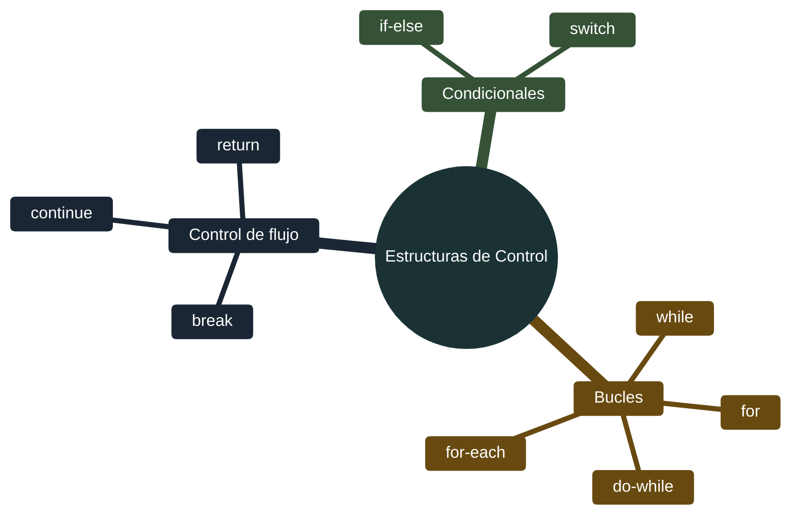
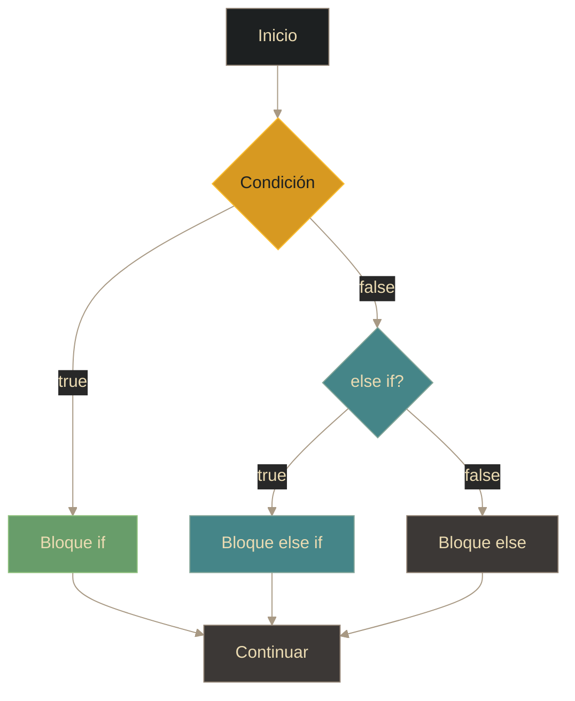
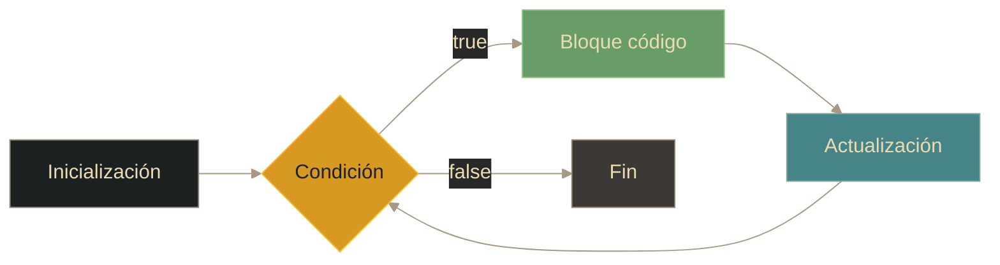

# Java - Estructuras de control

## Definición

Las estructuras de control determinan el **flujo de ejecución** del programa. Permiten tomar decisiones, repetir acciones y alterar el orden secuencial de ejecución.

## Explicación

- *Qué problema resuelve*
    Permite crear programas dinámicos que responden a diferentes condiciones, repiten tareas y toman decisiones basadas en datos.

- *Cómo funciona por arriba*
    - **Condicionales**: Evalúan expresiones booleanas y ejecutan bloques según el resultado
    - **Bucles**: Repiten bloques de código mientras se cumpla una condición
    - **Salto**: Alteran el flujo normal (break, continue, return)

- *Qué implica / qué permite*
    - Toma de decisiones basada en condiciones
    - Automatización de tareas repetitivas
    - Control granular del flujo del programa

## Tipos de estructuras

## Condicionales

### if-else

**Estructura:**
- `if` - ejecuta si la condición es true
- `else if` - condición alternativa (opcional, múltiples)
- `else` - se ejecuta si ninguna condición anterior es true (opcional)

### switch

- Evalúa una expresión contra múltiples casos
- Usa `case` para cada valor posible
- `break` evita "fall-through" (ejecutar casos siguientes)
- `default` caso por defecto si no coincide ninguno

> **Java 12+**: switch expression con yield para retornar valores

## Bucles

### for

- **Inicialización**: Se ejecuta una vez al inicio
- **Condición**: Se evalúa antes de cada iteración
- **Actualización**: Se ejecuta después de cada iteración

### while

- Evalúa la condición **antes** de ejecutar
- Puede ejecutarse 0 o más veces
- Útil cuando no se sabe cuántas iteraciones

### do-while

- Evalúa la condición **después** de ejecutar
- Se ejecuta al menos una vez
- Útil cuando se necesita al menos una ejecución

### for-each (enhanced for)

- Itera sobre colecciones o arrays
- Sintaxis simplificada: no necesita índice
- Solo lectura (no puede modificar la colección durante iteración)

## Comparativa de bucles

| Bucle | Cuándo usar | Característica |
|-------|-------------|----------------|
| **for** | Número conocido de iteraciones | Control total (inicio, condición, paso) |
| **while** | Condición lógica, 0+ iteraciones | Evalúa antes |
| **do-while** | Al menos 1 ejecución garantizada | Evalúa después |
| **for-each** | Recorrer colecciones/arrays | Más legible, sin índice |

## Control de flujo

| Sentencia | Qué hace | Uso típico |
|-----------|----------|------------|
| **break** | Sale del bucle/switch | Encontrar un valor, salir de switch |
| **continue** | Salta a siguiente iteración | Filtrar elementos |
| **return** | Sale del método y devuelve valor | Terminar ejecución con resultado |

## Palabras clave

- if / else / else if
- switch / case / break / default
- for / while / do-while
- for-each
- break / continue / return
- Condición / Iteración

## Comparaciones típicas

- vs [[06 - Java - Operadores]]: los operadores relacionales y lógicos se usan en las condiciones de estas estructuras
- vs otros lenguajes: Java requiere expresiones booleanas explícitas; C/C++ aceptan enteros como condiciones

## Preguntas de examen

- ¿Cuál es la diferencia entre `while` y `do-while`?
- ¿Qué hace `break` en un switch sin un case específico?
- ¿Cuándo es más apropiado usar `for-each` en lugar de `for` tradicional?
- ¿Qué es el "fall-through" en un switch?
- ¿Para qué sirve `continue` en un bucle?

## Errores comunes

- Olvidar `break` en switch (causa fall-through no deseado)
- Condición de bucle infinito (que nunca se vuelve false)
- Modificar la variable de control dentro del for
- Off-by-one errors (iterar una vez de más o de menos)
- Usar = en lugar de == en condiciones

## Mini-ejemplo (mental)

Las estructuras de control son como **semáforos y rutas en una carretera**: el `if-else` es un semáforo que te dice si sigues derecho o giras; el `switch` es una rotonda con múltiples salidas; los bucles `for/while` son circuitos cerrados que recorres varias veces hasta que se cumple una condición; y `break/continue/return` son salidas de emergencia que te sacan del camino normal.
