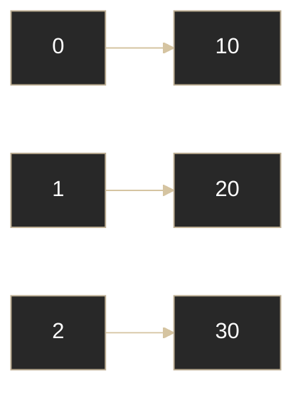

# Java - Arreglos (Arrays)

## Definición

Un arreglo es una estructura que guarda elementos del mismo tipo en posiciones indexadas y con tamaño fijo.

## Explicación

- *Qué problema resuelve*
    Permite agrupar muchos valores relacionados bajo un solo nombre.

- *Cómo funciona por arriba*
    - Se accede por índice (`0` a `length - 1`)
    - El tamaño se define al crearlo
    - Puede ser de una o más dimensiones

- *Qué implica / qué permite*
    - Acceso rápido por índice
    - Recorrido simple con bucles
    - Menos flexibilidad que una colección dinámica

## Visualización simple

## Arreglos vs colecciones

| Aspecto | Arreglo | ArrayList |
|---|---|---|
| Tamaño | Fijo | Dinámico |
| Acceso por índice | Sí | Sí |
| Flexibilidad | Baja | Alta |

## Palabras clave

- Array
- Índice
- `length`
- Tamaño fijo
- Multidimensional

## Comparaciones típicas

- vs [[09 - Colecciones - Introducción]]: arreglo prioriza simplicidad y tamaño fijo
- vs [[10 - Colecciones - Listas (List)]]: `ArrayList` crece y ofrece más operaciones

## Preguntas de examen

- ¿Cuál es la limitación principal de un array?
- ¿Cuál es el primer índice?
- ¿Qué diferencia clave hay con `ArrayList`?

## Errores comunes

- Acceder fuera de rango (`ArrayIndexOutOfBoundsException`)
- Confundir `length` con `size()`
- Creer que puede crecer automáticamente

## Mini-ejemplo (mental)

Es una fila de casilleros numerados: podés leer rápido por número, pero no agregar casilleros nuevos sin crear otra fila.
