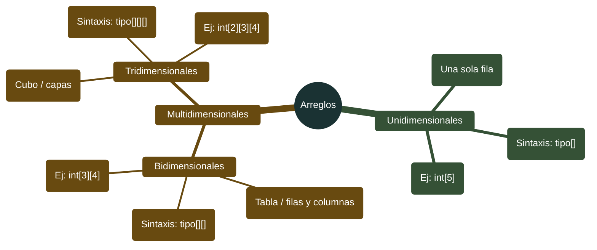
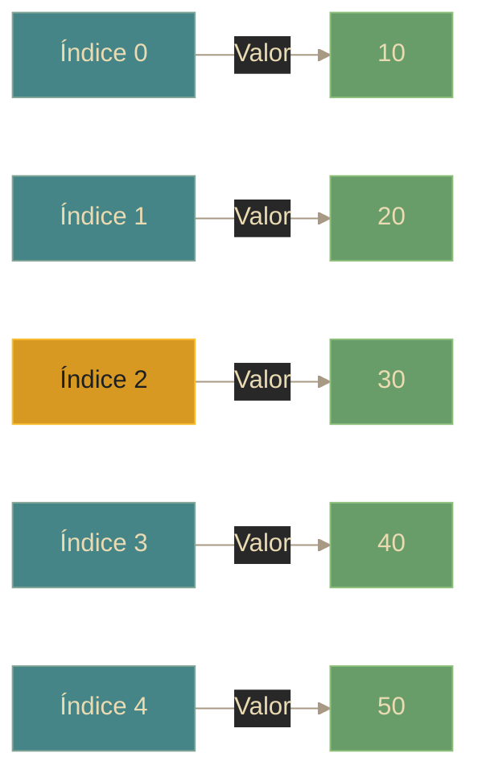

# Java - Arreglos (Arrays)

## Definición

Los arreglos son estructuras de datos que almacenan una **colección de elementos del mismo tipo** en posiciones contiguas de memoria. Tienen **tamaño fijo** definido al momento de creación.

## Explicación

- *Qué problema resuelve*
    Permite almacenar múltiples valores relacionados bajo un solo nombre, accesibles mediante índices numéricos. Útil para listas de datos del mismo tipo.

- *Cómo funciona por arriba*
    - Reserva un bloque contiguo de memoria
    - Cada elemento ocupa una posición indexada (0 a n-1)
    - El índice 0 es el primer elemento
    - El tamaño es inmutable después de crearlo

- *Qué implica / qué permite*
    - Almacenamiento ordenado de datos
    - Acceso rápido por índice (O(1))
    - Iteración secuencial
    - Tamaño fijo (limitación importante)

## Tipos de arreglos

## Arreglos unidimensionales

### Características
- Una sola fila de elementos
- Acceso mediante un índice: `array[índice]`
- Índices van de 0 a tamaño-1

### Visualización

### Limitaciones
- **Tamaño fijo**: No puede cambiar después de crearlo
- Si es muy pequeño: datos se pierden
- Si es muy grande: desperdicio de memoria
- Inserción/eliminación en medio es costosa (hay que mover elementos)

## Arreglos multidimensionales

### Bidimensionales (matrices)
- Como una tabla: filas y columnas
- Acceso: `matriz[fila][columna]`
- Útiles para: tableros de juego, matrices matemáticas, datos tabulares

### Tridimensionales
- Como un cubo: capas, filas, columnas
- Acceso: `cubo[capa][fila][columna]`
- Útiles para: juegos 3D (cubo Rubik), datos volumétricos

## Propiedad length

- Todos los arreglos tienen la propiedad `length`
- Devuelve el tamaño del arreglo
- Útil para bucles que recorren todo el arreglo

## Recorrido de arreglos

| Método | Cuándo usar | Características |
|--------|-------------|----------------|
| **for tradicional** | Necesitar índice | Control total del índice |
| **for-each** | Solo leer elementos | Más legible, sin índice |
| **while** | Condición especial | Flexibilidad |

## Arreglos vs Colecciones

| Característica | Arreglos | Colecciones (ArrayList, etc.) |
|----------------|----------|------------------------------|
| **Tamaño** | Fijo | Dinámico (crece automáticamente) |
| **Tipo de elementos** | Primitivos y objetos | Solo objetos (autoboxing para primitivos) |
| **Métodos** | Mínimos (length) | Muchos métodos útiles |
| **Generics** | No | Sí |
| **Rendimiento** | Más rápido acceso directo | Más flexible |

## Palabras clave

- Array / Arreglo
- Índice (index)
- length
- Unidimensional
- Bidimensional
- Multidimensional
- Tamaño fijo
- Elemento

## Comparaciones típicas

- vs [[09 - Colecciones - Introducción]]: arreglos son estáticos (tamaño fijo); colecciones son dinámicas
- vs [[10 - Colecciones - Listas (List)]]: ArrayList es la alternativa dinámica a los arreglos

## Preguntas de examen

- ¿Cuál es la principal limitación de los arreglos en Java?
- ¿Qué valor tiene el primer índice de un arreglo?
- ¿Cómo se accede a un elemento en un arreglo bidimensional?
- ¿Cuál es la diferencia entre arreglos y colecciones como ArrayList?
- ¿Qué propiedad devuelve el tamaño de un arreglo?

## Errores comunes

- ArrayIndexOutOfBoundsException: acceder a índice fuera de rango
- Pensar que arreglos pueden cambiar de tamaño
- Confundir `length` (propiedad de arreglos) con `size()` (método de colecciones)
- Olvidar que el último índice es `length - 1`, no `length`
- No inicializar el arreglo antes de usarlo

## Mini-ejemplo (mental)

Un arreglo es como **una fila de casilleros numerados**: tienes 5 casilleros (tamaño 5) numerados del 0 al 4, y cada uno guarda un valor. Una vez construida la fila, **no puedes agregar más casilleros** (tamaño fijo). Si quieres guardar más cosas, necesitas una estructura diferente (colecciones). Un arreglo bidimensional es como **un estacionamiento**: filas y columnas de espacios.
