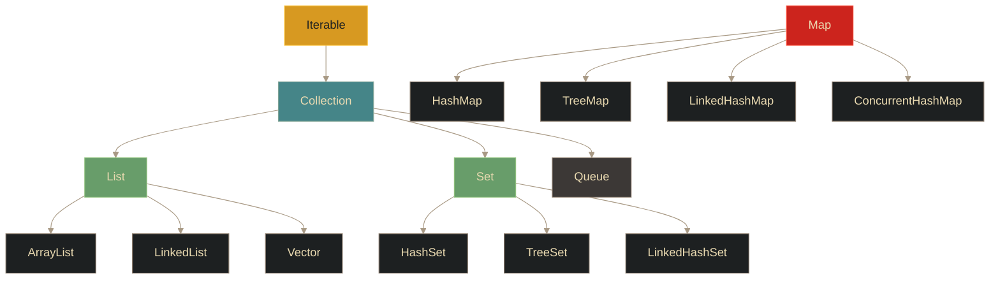

# Colecciones - Introducción

## Definición

Las **colecciones** son estructuras de datos que permiten almacenar y manipular conjuntos de elementos de forma eficiente y flexible. A diferencia de los arreglos, las colecciones tienen **tamaño dinámico**.

## Explicación

- *Qué problema resuelve*
    Los arreglos tienen tamaño fijo y operaciones limitadas. Las colecciones proporcionan estructuras que crecen automáticamente, ofrecen métodos ricos para manipular datos y optimizan diferentes operaciones según la implementación.

- *Cómo funciona por arriba*
    - Interfaces definen el comportamiento (qué operaciones existen)
    - Implementaciones concretas proveen algoritmos específicos
    - Framework de Colecciones organiza todo en una jerarquía
    - Cada implementación optimiza diferentes escenarios

- *Qué implica / qué permite*
    - Almacenamiento dinámico (crece automáticamente)
    - Múltiples implementaciones según necesidades
    - Algoritmos optimizados (búsqueda, inserción, ordenamiento)
    - Uso de Generics para tipado seguro

## Jerarquía del Framework de Colecciones

## Interfaces principales

| Interfaz | Descripción | Características |
|----------|-------------|-----------------|
| **Collection** | Raíz de la jerarquía | Operaciones básicas: add, remove, contains, size |
| **List** | Colección ordenada | Permite duplicados, acceso por índice |
| **Set** | Conjunto | No permite duplicados, sin orden específico |
| **Map** | Mapa clave-valor | Asociaciones únicas, acceso por clave |
| **Queue** | Cola | FIFO (First In, First Out) |

## Tipos de colecciones

### Listas (List)
- **Ordenada**: Mantiene orden de inserción
- **Indexada**: Acceso por posición
- **Duplicados**: Permite elementos repetidos
- **Implementaciones**: ArrayList, LinkedList, Vector

### Conjuntos (Set)
- **Sin duplicados**: Cada elemento es único
- **Sin orden**: (HashSet) u ordenado (TreeSet)
- **Uso**: Eliminar duplicados, operaciones de conjuntos
- **Implementaciones**: HashSet, TreeSet, LinkedHashSet

### Mapas (Map)
- **Pares clave-valor**: Cada entrada tiene una clave única
- **Acceso rápido**: Por clave, no por índice
- **Claves únicas**: Los valores pueden repetirse
- **Implementaciones**: HashMap, TreeMap, LinkedHashMap, ConcurrentHashMap

## Ventajas sobre arreglos

| Aspecto | Arreglos | Colecciones |
|---------|----------|-------------|
| **Tamaño** | Fijo | Dinámico (auto-crece) |
| **Métodos** | Mínimos (length) | Ricos (add, remove, contains, etc.) |
| **Generics** | No | Sí (`<Tipo>`) |
| **Implementaciones** | Solo uno | Múltiples según necesidad |
| **Rendimiento** | Acceso directo rápido | Optimizado según uso |

## Palabras clave

- Framework de Colecciones
- Collection / List / Set / Map
- Interfaz vs Implementación
- Generics
- Tamaño dinámico
- Iterable

## Comparaciones típicas

- vs [[08 - Java - Arreglos (Arrays)]]: colecciones son dinámicas y más flexibles; arreglos son estáticos
- vs [[10 - Colecciones - Listas (List)]]: List es una interfaz; ArrayList/LinkedList son implementaciones

## Preguntas de examen

- ¿Cuál es la diferencia principal entre arreglos y colecciones?
- ¿Qué es una interfaz y qué es una implementación en el contexto de colecciones?
- ¿Qué interfaz usarías para almacenar elementos sin duplicados?
- ¿Qué característica distingue a Map de las demás colecciones?
- ¿Qué son los Generics y por qué son útiles en colecciones?

## Errores comunes

- Confundir la interfaz (List) con la implementación (ArrayList)
- Pensar que Set permite duplicados
- Creer que Map es una colección (técnicamente no extiende Collection)
- No usar Generics (pérdida de tipado seguro)
- Elegir la implementación incorrecta para el caso de uso

## Mini-ejemplo (mental)

Las colecciones son como **diferentes tipos de contenedores**: una **Lista** es como una fila de personas en orden (puede haber gemelos/duplicados); un **Set** es como un conjunto de sellos únicos (no repetidos); un **Map** es como un diccionario (cada palabra/clave tiene una definición/valor). A diferencia de las cajas de tamaño fijo (arreglos), estos contenedores **se expanden automáticamente** cuando necesitas guardar más cosas.
