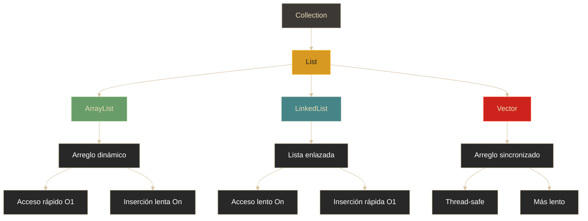

# Colecciones - Listas (List)

## Definición

Las **Listas** son colecciones ordenadas que permiten elementos duplicados y acceso por índice. La interfaz `List` extiende `Collection` y define el comportamiento de listas secuenciales.

## Explicación

- *Qué problema resuelve*
    Proporciona estructuras de datos dinámicas que mantienen el orden de inserción, permiten acceso posicional y manejan duplicados. A diferencia de los arreglos, crecen automáticamente.

- *Cómo funciona por arriba*
    - Interface `List` define operaciones: add, get, remove, set, indexOf
    - Implementaciones usan diferentes estructuras internas
    - ArrayList: arreglo dinámico
    - LinkedList: lista doblemente enlazada
    - Vector: similar a ArrayList pero sincronizado (thread-safe)

- *Qué implica / qué permite*
    - Acceso por índice (posición)
    - Mantenimiento del orden de inserción
    - Permitir elementos duplicados
    - Diferentes implementaciones según necesidades de rendimiento

## Jerarquía y estructura

## ArrayList

### Características
- Basado en **arreglo dinámico** que se redimensiona automáticamente
- Acceso por índice muy rápido: **O(1)**
- Inserción/eliminación en medio: **O(n)** (debe mover elementos)
- **No sincronizado** (no thread-safe)
- Cuando se llena, crea nuevo arreglo 50% más grande y copia elementos

### Cuándo usar
- Acceso frecuente por índice
- Recorrido secuencial
- Pocas inserciones/eliminaciones en medio

## LinkedList

### Características
- Basada en **nodos enlazados** (doble enlace)
- Cada nodo tiene: dato + referencia al siguiente + referencia al anterior
- Acceso por índice lento: **O(n)** (debe recorrer)
- Inserción/eliminación rápida: **O(1)** (solo cambia referencias)
- **No sincronizada**

### Cuándo usar
- Muchas inserciones/eliminaciones
- Poco acceso por índice
- Implementación de colas o pilas

## Vector

### Características
- Similar a ArrayList pero **sincronizado** (thread-safe)
- Métodos son `synchronized`
- Cuando se llena, crea arreglo con capacidad fija de incremento (diferente de ArrayList)
- **Más lento** que ArrayList por el overhead de sincronización
- Legado de Java 1.0

### Cuándo usar
- Aplicaciones multihilo donde múltiples threads acceden a la lista
- En general, se prefiere `ArrayList` + `Collections.synchronizedList()`

## Comparativa de implementaciones

| Operación | ArrayList | LinkedList | Vector |
|-----------|-----------|------------|--------|
| **get(index)** | 🚀 O(1) - Directo | 🐢 O(n) - Recorre | 🚀 O(1) |
| **add(ultimo)** | ⚡ O(1)* | 🚀 O(1) | ⚡ O(1)* |
| **add(inicio)** | ❌ O(n) - Mueve todos | 🚀 O(1) | ❌ O(n) |
| **add(medio)** | 🐢 O(n) | 🚀 O(1) cerca de extremos | 🐢 O(n) |
| **remove** | 🐢 O(n) | 🚀 O(1) | 🐢 O(n) |
| **Memoria** | ✅ Menor | ❌ Mayor (referencias) | ✅ Menor |
| **Thread-safe** | ❌ No | ❌ No | ✅ Sí |
| **Overhead sync** | Ninguno | Ninguno | Alto |

*Amortizado, puede ser O(n) si necesita redimensionar

## Estructura interna visual

### ArrayList

### LinkedList

## Palabras clave

- List / ArrayList / LinkedList / Vector
- Acceso por índice
- Arreglo dinámico
- Lista enlazada (nodos)
- Sincronización (thread-safe)
- O(1) vs O(n)
- Redimensionamiento

## Comparaciones típicas

- vs [[09 - Colecciones - Introducción]]: List es la interfaz; ArrayList/LinkedList/Vector son implementaciones
- vs [[08 - Java - Arreglos (Arrays)]]: ArrayList es un arreglo dinámico; los arreglos son estáticos
- vs [[11 - Colecciones - Mapas (Map)]]: List usa índices numéricos; Map usa claves arbitrarias

## Preguntas de examen

- ¿Cuál es la diferencia entre ArrayList y LinkedList?
- ¿Por qué LinkedList es mejor para inserciones frecuentes?
- ¿Qué significa que Vector sea "sincronizado"?
- ¿Cuál es la complejidad O(?) de get(index) en ArrayList?
- ¿Cuándo debería usar Vector sobre ArrayList?

## Errores comunes

- Usar LinkedList cuando se necesita acceso frecuente por índice (muy lento)
- Usar Vector en aplicaciones no concurrentes (overhead innecesario)
- No considerar el costo de redimensionamiento en ArrayList
- Pensar que todas las operaciones son igual de rápidas en todas las implementaciones
- Modificar la lista mientras se itera (ConcurrentModificationException)

## Mini-ejemplo (mental)

**ArrayList** es como **una fila de sillas numeradas en el cine**: llegas directo a tu asiento (acceso rápido), pero si alguien se sienta en medio, todos los demás deben moverse (inserción lenta).

**LinkedList** es como **el juego del teléfono**: para llegar al final debes pasar por todos los participantes (acceso lento), pero insertar a alguien es solo tomar las manos de dos personas (inserción rápida).

**Vector** es como **una fila de sillas con un guardia de seguridad**: solo una persona puede moverse a la vez (thread-safe), lo que hace todo más lento pero seguro en multitudes (multihilo).
