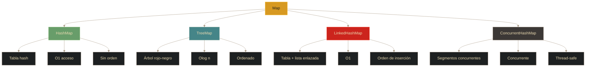

# Colecciones - Mapas (Map)

## Definición

Los **Mapas** son colecciones que almacenan pares **clave-valor**. Cada clave es única y se asocia a un valor. Permiten acceso rápido a valores mediante su clave, sin depender de índices numéricos.

## Explicación

- *Qué problema resuelve*
    Permite asociar datos de forma eficiente (por ejemplo, usuario-contraseña, producto-precio, DNI-persona). El acceso por clave es mucho más rápido que buscar en una lista.

- *Cómo funciona por arriba*
    - Cada entrada es un par clave-valor
    - Las claves son únicas (no pueden repetirse)
    - Los valores pueden repetirse
    - Diferentes implementaciones usan diferentes estructuras internas
    - HashMap usa función hash para calcular posición

- *Qué implica / qué permite*
    - Acceso rápido por clave (O(1) en HashMap)
    - Búsqueda eficiente sin recorrer toda la colección
    - Diferentes estrategias: ordenado, inserción, concurrente
    - Claves null (generalmente permitido, una sola)

## Jerarquía de implementaciones

## HashMap

### Características
- Implementación basada en **tabla hash**
- Acceso muy rápido: **O(1)** promedio
- **No mantiene orden** de inserción
- Permite **una clave null** y múltiples valores null
- **No sincronizado** (no thread-safe)

### Función Hash
- Convierte la clave en un número (hash code)
- Determina el "bucket" o posición donde se almacena
- Colisiones: cuando dos claves tienen mismo hash, se almacenan en lista dentro del bucket

## TreeMap

### Características
- Implementación basada en **árbol rojo-negro** (self-balancing BST)
- Mantiene elementos **ordenados** por clave
- Acceso: **O(log n)**
- Más lento que HashMap pero ordenado
- **No permite claves null** (necesita comparar para ordenar)
- Puede usar orden natural o un Comparator personalizado

### Cuándo usar
- Necesitas recorrer en orden las claves
- Rangos de búsqueda (subMap, headMap, tailMap)
- Ej: sistema de calificaciones ordenadas por nombre

## LinkedHashMap

### Características
- Combina **tabla hash** + **lista doblemente enlazada**
- Mantiene **orden de inserción** (o de acceso opcional)
- Acceso: **O(1)** (similar a HashMap)
- Un poco más de overhead que HashMap por mantener el orden

### Modo de acceso
- Por defecto: orden de inserción
- Opcional: orden de acceso (LRU - Least Recently Used)
- Útil para implementar caches

## ConcurrentHashMap

### Características
- Diseñado para **acceso concurrente** (multihilo)
- Divide la tabla en **segmentos** bloqueables independientemente
- Múltiples threads pueden leer/escribir en diferentes segmentos simultáneamente
- **Thread-safe** sin bloquear toda la estructura
- Mejor rendimiento que Hashtable (que bloquea todo)

### Ventaja sobre Hashtable
- Hashtable: sincroniza TODO el mapa (un solo thread a la vez)
- ConcurrentHashMap: sincroniza por segmentos (varios threads pueden operar)

## Comparativa de implementaciones

| Característica | HashMap | TreeMap | LinkedHashMap | ConcurrentHashMap |
|----------------|---------|---------|---------------|-------------------|
| **Estructura** | Tabla hash | Árbol R-N | Hash + Lista | Segmentos |
| **Orden** | ❌ Ninguno | ✅ Natural | 🔄 Inserción | ❌ Ninguno |
| **Acceso** | ⚡ O(1) | 🐢 O(log n) | ⚡ O(1) | ⚡ O(1) |
| **Clave null** | ✅ Sí (1) | ❌ No | ✅ Sí (1) | ❌ No |
| **Thread-safe** | ❌ No | ❌ No | ❌ No | ✅ Sí |
| **Overhead** | Bajo | Medio | Medio | Alto |

## Palabras clave

- Map / HashMap / TreeMap / LinkedHashMap / ConcurrentHashMap
- Clave-valor (key-value)
- Función hash / hash code
- Tabla hash
- Árbol rojo-negro
- Orden de inserción
- Thread-safe / Concurrente
- Colisión

## Comparaciones típicas

- vs [[10 - Colecciones - Listas (List)]]: Map usa claves únicas; List usa índices numéricos
- vs [[09 - Colecciones - Introducción]]: Map no extiende Collection (es aparte)
- HashMap vs TreeMap: HashMap es más rápido; TreeMap mantiene orden
- HashMap vs LinkedHashMap: LinkedHashMap preserva orden de inserción
- HashMap vs ConcurrentHashMap: ConcurrentHashMap es thread-safe para multihilo

## Preguntas de examen

- ¿Qué es una función hash y para qué sirve en HashMap?
- ¿Cuál es la diferencia entre HashMap y TreeMap?
- ¿Por qué LinkedHashMap mantiene orden de inserción?
- ¿Qué ventaja tiene ConcurrentHashMap sobre Hashtable?
- ¿Las claves en un Map pueden repetirse? ¿Y los valores?
- ¿Qué es una colisión en una tabla hash?

## Errores comunes

- Iterar sobre Map sin usar entrySet() (ineficiente)
- Modificar el mapa mientras se itera (ConcurrentModificationException)
- Usar objetos mutables como claves (el hash cambia, se pierde el valor)
- Pensar que HashMap mantiene orden (usar LinkedHashMap o TreeMap)
- No considerar que TreeMap no acepta claves null
- Usar Hashtable en lugar de ConcurrentHashMap (peor rendimiento)

## Mini-ejemplo (mental)

Un **HashMap** es como **un sistema de casilleros de gimnasio**: tienes una llave (clave) que abre exactamente un casillero específico. No hay orden particular, pero llegas directo al tuyo.

Un **TreeMap** es como **un diccionario ordenado**: las palabras (claves) están ordenadas alfabéticamente, puedes buscar rangos (palabras que empiezan con A-B), pero tomar más tiempo encontrar una palabra específica.

Un **LinkedHashMap** es como **una fila de casilleros numerados por orden de llegada**: cada nuevo casillero se agrega al final de la fila, manteniendo el orden en que llegaron las personas.

Un **ConcurrentHashMap** es como **múltiples filas de casilleros con guardias separados**: diferentes personas pueden usar diferentes filas al mismo tiempo sin esperarse entre sí.
