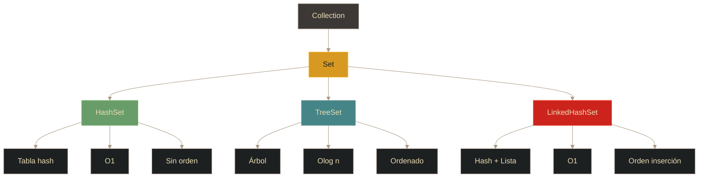
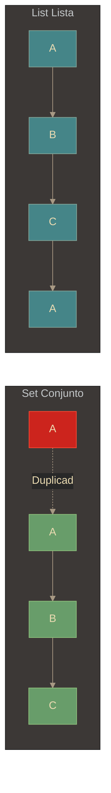

# Colecciones - Conjuntos (Set)

## Definición

Los **Conjuntos** son colecciones que **no permiten elementos duplicados**. No garantizan orden específico (excepto implementaciones ordenadas) y se usan cuando se necesita unicidad de elementos.

## Explicación

- *Qué problema resuelve*
    Elimina duplicados automáticamente y proporciona operaciones eficientes de búsqueda y verificación de membresía. Útil para garantizar unicidad y operaciones de conjuntos (unión, intersección, diferencia).

- *Cómo funciona por arriba*
    - Basado en el principio matemático de conjuntos
    - Cada elemento es único (determinado por equals() y hashCode())
    - No hay acceso por índice (a diferencia de List)
    - Verificación de existencia con contains() es eficiente

- *Qué implica / qué permite*
    - Almacenar solo elementos únicos
    - Operaciones de conjuntos (unión, intersección)
    - Diferentes implementaciones según necesidades de orden
    - Búsqueda rápida sin duplicados

## Jerarquía de implementaciones

## HashSet

### Características
- Implementación basada en **HashMap** (usa el mapa internamente)
- **No mantiene orden** de inserción
- Acceso muy rápido: **O(1)** promedio
- Permite **elemento null** (uno solo)
- **No sincronizado**

### Funcionamiento interno
- Almacena elementos como **claves de un HashMap** (los valores son objetos dummy)
- Usa hashCode() y equals() para determinar duplicados

## TreeSet

### Características
- Implementación basada en **TreeMap** (árbol rojo-negro)
- Mantiene elementos **ordenados** según orden natural o Comparator
- Acceso: **O(log n)**
- **No permite elementos null** (necesita comparar)
- Más lento que HashSet pero ordenado

### Cuándo usar
- Necesitas elementos ordenados
- Operaciones de rango (subSet, headSet, tailSet)
- Ej: lista ordenada de palabras únicas

## LinkedHashSet

### Características
- Combina **HashSet** + lista enlazada
- Mantiene **orden de inserción**
- Acceso: **O(1)** (como HashSet)
- Un poco más de overhead por mantener orden
- Único que ofrece unicidad + orden de inserción

### Cuándo usar
- Necesitas eliminar duplicados pero mantener orden de llegada
- Ej: historial de navegación único

## Comparativa de implementaciones

| Característica | HashSet | TreeSet | LinkedHashSet |
|----------------|---------|---------|---------------|
| **Estructura** | Tabla hash | Árbol rojo-negro | Hash + Lista |
| **Orden** | ❌ Ninguno | ✅ Ordenado | 🔄 Inserción |
| **Velocidad** | ⚡ O(1) | 🐢 O(log n) | ⚡ O(1) |
| **Elemento null** | ✅ Sí (1) | ❌ No | ✅ Sí (1) |
| **Overhead** | Bajo | Medio | Medio |

## Set vs List

| Característica | Set | List |
|----------------|-----|------|
| **Duplicados** | ❌ No permitidos | ✅ Permitidos |
| **Orden** | Depende de implementación | ✅ Mantiene orden |
| **Acceso por índice** | ❌ No | ✅ Sí |
| **Uso típico** | Eliminar duplicados, unicidad | Secuencias ordenadas |

## Palabras clave

- Set / HashSet / TreeSet / LinkedHashSet
- Unicidad (no duplicados)
- hashCode() / equals()
- Orden de inserción
- Orden natural
- Unión / Intersección / Diferencia

## Comparaciones típicas

- vs [[10 - Colecciones - Listas (List)]]: Set no permite duplicados ni acceso por índice; List sí
- vs [[11 - Colecciones - Mapas (Map)]]: Set usa solo valores (sin claves); Map usa pares clave-valor
- HashSet vs TreeSet: HashSet es más rápido; TreeSet mantiene orden
- HashSet vs LinkedHashSet: LinkedHashSet preserva orden de inserción

## Preguntas de examen

- ¿Qué diferencia principal tiene un Set respecto a un List?
- ¿Cómo determina HashSet si un elemento está duplicado?
- ¿Cuál implementación de Set mantiene orden de inserción?
- ¿Por qué TreeSet no permite elementos null?
- ¿Cuándo usarías LinkedHashSet sobre HashSet?

## Errores comunes

- Intentar acceder por índice a un Set (no tiene índices)
- Esperar que HashSet mantenga orden de inserción
- Modificar objetos después de agregarlos al Set (pueden quedar inaccesibles)
- No implementar hashCode() y equals() correctamente en objetos personalizados
- Usar Set cuando realmente se necesita List con duplicados permitidos

## Mini-ejemplo (mental)

Un **Set** es como **un conjunto de sellos de colección**: solo guardas uno de cada tipo (no duplicados), y no importa el orden en que los guardes. Un **HashSet** es como una caja desordenada donde llegas rápido al sello que buscas; un **TreeSet** es como un álbum ordenado alfabéticamente; y un **LinkedHashSet** es como una fila donde los sellos se van agregando al final en orden de llegada.
