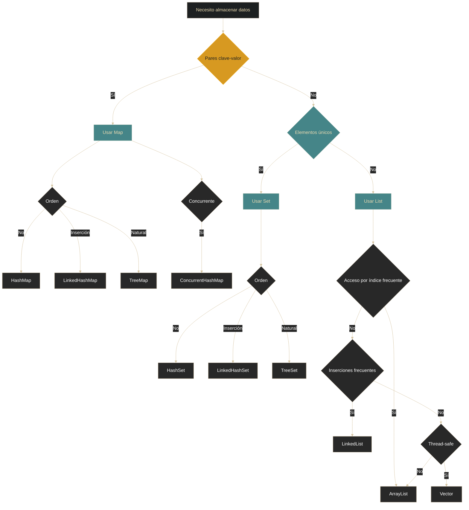

# Colecciones - Cómo elegir la estructura

## Definición

Guía de decisión para seleccionar la estructura de datos apropiada según las necesidades específicas del problema. La elección correcta optimiza el rendimiento y la legibilidad del código.

## Explicación

- *Qué problema resuelve*
    Evita el uso de estructuras inadecuadas que pueden causar problemas de rendimiento o funcionalidad. Cada implementación tiene fortalezas y debilidades específicas.

- *Cómo funciona por arriba*
    - Analizar los requisitos: acceso, inserción, orden, concurrencia
    - Comparar complejidades temporales (Big O)
    - Considerar restricciones: memoria, thread-safety
    - Elegir la implementación que mejor se adapte

- *Qué implica / qué permite*
    - Código más eficiente
    - Uso óptimo de memoria
    - Mantenimiento más sencillo
    - Escalabilidad adecuada

## Árbol de decisión

## Decisiones rápidas

### ¿Necesito pares clave-valor?
**Sí → Usar Map**
- Sin orden: **HashMap**
- Orden de inserción: **LinkedHashMap**
- Orden natural: **TreeMap**
- Multihilo: **ConcurrentHashMap**

**No → Continuar**

### ¿Elementos deben ser únicos?
**Sí → Usar Set**
- Sin orden: **HashSet**
- Orden de inserción: **LinkedHashSet**
- Ordenado: **TreeSet**

**No → Usar List**

### ¿Acceso por índice frecuente?
**Sí → ArrayList**

**No → ¿Muchas inserciones/eliminaciones?**
- Sí → **LinkedList**
- No → **ArrayList** (generalmente)

### ¿Necesito thread-safety?
**Sí →**
- Map: **ConcurrentHashMap**
- List: **Vector** o `Collections.synchronizedList(new ArrayList())`
- Set: `Collections.synchronizedSet(new HashSet())`

**No → Implementaciones estándar**

## Tabla comparativa general

| Si necesitas... | Usa... | Evita... |
|-----------------|--------|----------|
| Acceso rápido por clave | HashMap | List, Array |
| Orden de inserción | LinkedHashMap, LinkedHashSet | HashMap, HashSet |
| Orden natural | TreeMap, TreeSet | HashMap, HashSet |
| Sin duplicados | Set | List |
| Acceso por posición | ArrayList | LinkedList |
| Muchas inserciones | LinkedList | ArrayList |
| Multihilo | ConcurrentHashMap, Vector | HashMap, ArrayList |
| Tamaño fijo conocido | Array (primitivo) | Colecciones |

## Casos de uso comunes

### Historial de navegación único
- Requisitos: único + orden de inserción
- **LinkedHashSet**

### Lista de tareas pendientes
- Requisitos: ordenado + permite duplicados
- **ArrayList** o **LinkedList**

### Diccionario palabra-definición
- Requisitos: clave-valor + búsqueda rápida
- **HashMap**

### Sistema de calificaciones ordenado
- Requisitos: clave-valor + ordenado
- **TreeMap**

### Cache LRU (Least Recently Used)
- Requisitos: orden de acceso + eficiente
- **LinkedHashMap** (modo access-order)

### Contador de palabras
- Requisitos: clave-valor + concurrencia
- **ConcurrentHashMap**

## Palabras clave

- Árbol de decisión
- Complejidad temporal
- Thread-safety
- Rendimiento
- Caso de uso
- Trade-offs

## Comparaciones típicas

- vs [[09 - Colecciones - Introducción]]: esta guía aplica los conceptos de las colecciones
- vs [[10 - Colecciones - Listas (List)]]: compara implementaciones específicas
- vs [[11 - Colecciones - Mapas (Map)]]: compara implementaciones específicas
- vs [[12 - Colecciones - Conjuntos (Set)]]: compara implementaciones específicas

## Preguntas de examen

- ¿Qué estructura usarías para almacenar usuarios con acceso rápido por DNI?
- ¿Cuál es mejor para una lista de tareas donde solo importa el orden de llegada?
- ¿Qué implementación de Map elegirías para una aplicación multihilo?
- ¿Cuándo usarías LinkedList sobre ArrayList?
- ¿Qué estructura permite elementos duplicados y acceso por índice?

## Errores comunes

- Usar Vector siempre "por seguridad" (overhead innecesario)
- Elegir ArrayList cuando se hacen muchas inserciones en medio
- Usar HashMap cuando se necesita orden
- Olvidar considerar thread-safety en aplicaciones concurrentes
- Elegir estructura sin analizar las operaciones más frecuentes

## Mini-ejemplo (mental)

Elegir una estructura de datos es como **elegir el vehículo adecuado para un viaje**:
- ¿Vas solo con una mochila? → Bicicleta (Array simple)
- ¿Viaje familiar con equipaje? → Auto (ArrayList)
- ¿Mudanza completa? → Camión (HashMap para acceso rápido)
- ¿Transporte público organizado? → Tren ordenado (TreeSet)
- ¿Viaje compartido donde cada uno llega cuando puede? → LinkedHashSet

La clave es **conocer tu carga (datos) y tu ruta (operaciones)** antes de elegir el vehículo (estructura).
