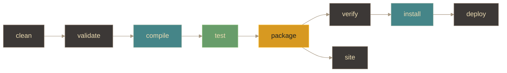

# Maven - Ciclo de vida

## Definición
El ciclo de vida de Maven es una secuencia de fases que se ejecutan en un orden específico para construir, empaquetar y distribuir software. Las fases estan definidas por el archivo POM y son:

- `clean`: limpia archivos generados previamente
- `validate`: valida estructura del proyecto
- `compile`: compila el código fuente
- `test`: ejecuta tests unitarios
- `package`: empaqueta (JAR/WAR)
- `verify`: verifica el paquete
- `install`: instala en repositorio local
- `deploy`: publica en repositorio remoto
- `site`: genera documentación

## Explicación
- *Qué problema resuelve*
    El ciclo de vida de Maven estandariza y automatiza el proceso de construcción, asegurando que las fases necesarias se ejecuten en el orden correcto.
- *Cómo funciona por arriba*
    Maven usa el `pom.xml` para asociar plugins/goals a fases. Cuando corrés una fase (por ejemplo `mvn test`), Maven ejecuta esa fase y todas las anteriores necesarias, llamando a los plugins correspondientes.
- *Qué implica / qué permite*
    Permite automatizar build, tests y empaquetado, reduciendo errores humanos y facilitando CI/CD y colaboración.

## Flujo del lifecycle (idea)

## Palabras clave
- Fases
- Plugins
- POM (Project Object Model)
- Construcción automatizada
- Gestión de proyectos

## Comparaciones típicas
- vs [[08 - Maven - Plugins]]: el ciclo de vida define fases; los plugins aportan los goals que se ejecutan en esas fases.
- vs [[06 - Maven - Archivos de configuración]]: el lifecycle es estándar; el POM decide qué plugins/goals corren en cada fase.

## Preguntas de examen
- ¿Cuáles son las fases principales del ciclo de vida de Maven y qué hace cada una?
- ¿Cómo se relacionan los plugins con las fases del ciclo de vida de Maven?

## Errores comunes
- Confundir fases del ciclo de vida con plugins: las fases son etapas del proceso, mientras que los plugins son herramientas que realizan tareas específicas en esas etapas.
- No entender el orden de las fases: ejecutar una fase sin haber completado las anteriores puede llevar a errores en la construcción del proyecto.

## Mini-ejemplo (mental)
Es como una receta de cocina donde cada fase es un paso en la preparación del platillo. Primero limpias la cocina (clean), luego preparas los ingredientes (validate), cocinas el platillo (compile), pruebas su sabor (test), lo empacas para llevar (package), verificas que todo esté bien (verify), lo guardas en tu despensa (install) y finalmente lo compartes con tus amigos (deploy). Cada paso debe seguirse en orden para que el platillo salga perfecto.
