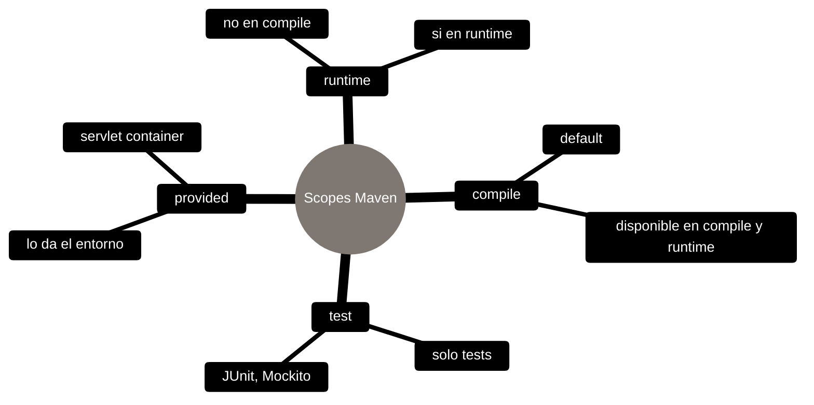

# Maven - Gestión de dependencias

## Definición
La gestión de dependencias en Maven es el proceso de declarar bibliotecas externas en `pom.xml` para que Maven las resuelva, descargue y mantenga consistentes (incluyendo dependencias transitivas).

## Explicación
- *Qué problema resuelve*
    Evita manejo manual de JARs, reduce conflictos de versiones y hace reproducible el classpath del proyecto.
- *Cómo funciona por arriba*
    - Declarás dependencias en `pom.xml` (groupId/artifactId/version)
    - Maven descarga desde repositorios (ej. Maven Central) al repositorio local
    - Resuelve dependencias transitivas y selecciona versiones según reglas
- *Qué implica / qué permite*
    - Colaboración más simple: todos instalan lo mismo con `mvn`/`mvnw`
    - Actualizar versiones cambiando un campo en el POM
    - Excluir transitivas no deseadas cuando causan conflicto o sobran

## Scopes típicos (mapa)



## Ejemplos comunes

### Agregar dependencias
En Maven, las dependencias se declaran en el archivo `pom.xml` del proyecto. Cada dependencia se especifica con un grupo, un artefacto y una versión.

```xml
<dependency>
    <groupId>org.springframework</groupId>
    <artifactId>spring-core</artifactId>
    <version>5.3.8</version>
</dependency>
```

### Excluir dependencias transitivas
A veces, una dependencia que agregás puede traer otras dependencias (transitivas) que no querés. Podés excluirlas así:

```xml
<dependency>
    <groupId>com.example</groupId>
    <artifactId>example-lib</artifactId>
    <version>1.0.0</version>
    <exclusions>
        <exclusion>
            <groupId>org.unwanted</groupId>
            <artifactId>unwanted-lib</artifactId>
        </exclusion>
    </exclusions>
</dependency>
```

## Palabras clave
- Dependencias
- Transitive dependencies
- Repositorios
- POM (Project Object Model)
- Plugins
- Build lifecycle
- Classpath

## Comparaciones típicas
- vs [[06 - Maven - Archivos de configuración]]: declarás dependencias en `pom.xml`; Maven las resuelve/descarga desde repos.
- vs [[08 - Maven - Plugins]]: dependencias son código que tu app usa; plugins son herramientas del build (compilación, tests, empaquetado).

## Preguntas de examen
- ¿Cómo se declaran las dependencias en un proyecto Maven?
- ¿Qué son las dependencias transitivas y cómo se gestionan en Maven?
- ¿Cuál es la diferencia entre una dependencia y un plugin en Maven?

## Errores comunes
- No declarar correctamente las dependencias en el `pom.xml`, lo que puede llevar a errores de compilación o ejecución.
- No gestionar las versiones de las dependencias, lo que puede causar conflictos entre diferentes bibliotecas.
- Olvidar excluir dependencias transitivas no deseadas, lo que puede aumentar innecesariamente el tamaño del proyecto o causar conflictos.

## Mini-ejemplo (mental)
La gestión de dependencias es como tener una lista de ingredientes para una receta. Maven se encarga de ir a la tienda (repositorio) y traer lo que falta, incluyendo ingredientes “dentro de ingredientes” (dependencias transitivas), evitando compras duplicadas o incompatibles.
