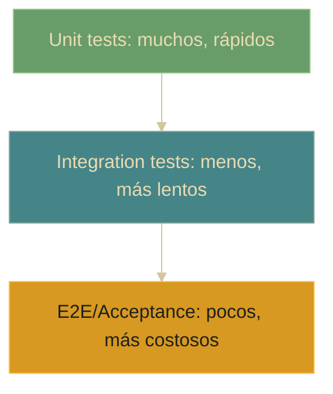

# Testing - Introducción

## Definición
El testing es el proceso de evaluar y verificar el comportamiento de un sistema, aplicación o módulo de software para asegurarse de que funciona correctamente y cumple con los requerimientos especificados.

## Explicación
- *Qué problema resuelve*
    Permite identificar errores, bugs o problemas de rendimiento antes de que el software sea entregado al usuario final, mejorando la calidad del producto.
- *Cómo funciona por arriba*
    Se crean casos de prueba que ejecutan el código bajo diferentes condiciones y se verifican los resultados contra valores esperados. Puede ser manual o automatizado.
- *Qué implica / qué permite*
    Mejora la calidad y eficiencia del desarrollo. Reduce costos al detectar errores temprano. Facilita la colaboración en equipos al garantizar que los cambios no rompan funcionalidades existentes.

## Pirámide de testing (idea)

## Herramientas principales en Java
- **JUnit**: Framework de pruebas unitarias para crear y ejecutar tests automatizados.
- **TestNG**: Alternativa a JUnit con funcionalidades adicionales.
- **Mockito**: Framework para crear objetos simulados (mocks) y aislar dependencias.

## Palabras clave
- Testing
- Calidad de software
- Bugs
- Casos de prueba
- Automatización
- JUnit
- Mockito

## Comparaciones típicas
- vs [[11 - Testing - Fundamentos]]: introducción = panorama general y por qué testear; fundamentos = conceptos y principios que sostienen la práctica.
- vs [[12 - Testing - Tests unitarios]]: intro es general; unit tests son el tipo de test más "chico" y rápido.

## Preguntas de examen
- ¿Qué es el testing y cuál es su objetivo principal?
- ¿Cuáles son las herramientas de testing más populares en Java?
- ¿Por qué es importante realizar testing en el desarrollo de software?

## Errores comunes
- Pensar que el testing solo es necesario en proyectos grandes (todo proyecto se beneficia del testing).
- Confundir testing manual con automatizado: ambos son válidos pero tienen diferentes propósitos.
- Creer que el testing garantiza software sin errores (reduce bugs, pero no los elimina al 100%).

## Mini-ejemplo (mental)
El testing es como revisar un ensayo antes de entregarlo. Lees cada párrafo (unidad) buscando errores de ortografía (bugs), verificas que las ideas fluyan correctamente (integración) y finalmente te aseguras de que el ensayo responde la pregunta original (aceptación). Cuanto antes encuentres un error, más fácil es corregirlo.
