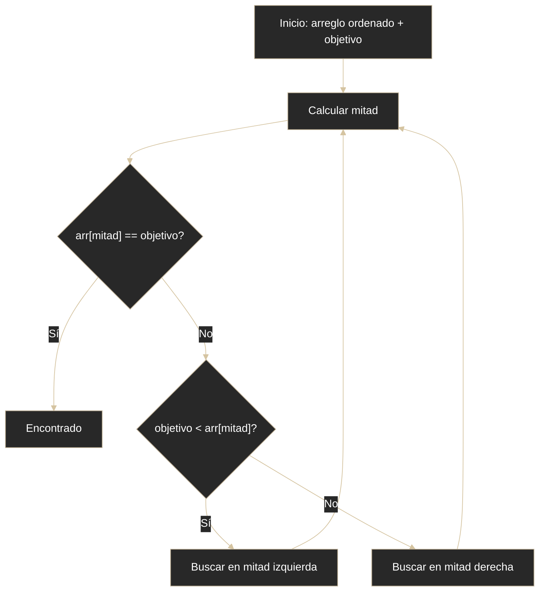

# Búsqueda - Binaria

## Definición
La búsqueda binaria encuentra un valor en datos ordenados descartando la mitad del espacio en cada paso.

## Explicación

- *Qué problema resuelve*
    Localizar elementos de forma extremadamente eficiente en colecciones ordenadas, reduciendo drásticamente el tiempo respecto a la búsqueda lineal
- *Cómo funciona por arriba*
    - **Requisito importante**: el arreglo debe estar ordenado previamente
    - Reduce el espacio de búsqueda a la mitad en cada paso:
        1. Se toma el índice del medio del arreglo
        2. Se compara ese valor con el buscado
        3. Si es igual, se encontró
        4. Si el valor buscado es menor, se repite en la mitad izquierda
        5. Si es mayor, se repite en la mitad derecha
    - **Ejemplo**: Buscar 13 en lista ordenada [1..20]: Paso 1: mitad=10(valor 11), 13>11 → buscar en [11-20]; Paso 2: mitad=15(valor 16), 13<16 → buscar en [11-15]; Paso 3: mitad=13(valor 14), 13<14 → buscar en [11-13]; Paso 4: encuentra 13
- *Qué implica / qué permite*
    - Cada paso descarta la mitad de los elementos
    - Muy rápido incluso con listas grandes
    - Complejidad O(log n): para n=1.000.000 solo ~20 comparaciones

## Diagrama (Mermaid)

## Comparaciones típicas
- vs [[16 - Búsqueda - Lineal]]: O(log n) con requisito de ordenamiento vs O(n) sin requisitos
- vs [[15 - Big-O - O(log n) logarítmica]]: aplicación práctica de complejidad logarítmica
- vs [[25 - Estrategias - Divide and Conquer]]: caso concreto de una estrategia de reducción por mitades

## Palabras clave
- búsqueda binaria
- O(log n)
- arreglo ordenado
- mitad
- comparación

## Preguntas de examen
- ¿Por qué la búsqueda binaria requiere colección ordenada?
- ¿Qué ventaja práctica tiene sobre lineal en n grande?

## Errores comunes
- Aplicarla sobre datos no ordenados.
- Implementar mal límites izquierdo/derecho y caer en bucles infinitos.

## Mini-ejemplo (mental)
- Buscar una palabra en diccionario abriendo por la mitad en cada intento.
