# Fibonacci - Programación dinámica

## Definición
Aplica programación dinámica para evitar recálculos en Fibonacci guardando resultados parciales.

## Explicación

- *Qué problema resuelve*
    Elimina la redundancia de cálculos del Fibonacci recursivo almacenando resultados ya calculados, reduciendo complejidad de exponencial a lineal
- *Cómo funciona por arriba*
    - **Definición**: Es una técnica de optimización que evita cálculos repetidos almacenando los resultados ya calculados (memorización)
    - **Dos formas**:
        - **Top-down**: recursión + memoización (guarda resultados en array/diccionario)
        - **Bottom-up**: iterativa, más eficiente porque evita el uso de la pila de llamadas
    - **Implementación bottom-up**:
      ```java
      int fibonacciDinamico(int n) {
          if (n == 0) return 0;
          int a = 0, b = 1;
          for (int i = 2; i <= n; i++) {
              int temp = a + b;
              a = b;
              b = temp;
          }
          return b;
      }
      ```
- *Qué implica / qué permite*
    - **Complejidad**: Tiempo O(n) - ¡Pasamos de millones de llamadas a unas pocas operaciones!
    - Permite calcular F(n) para n muy grandes en tiempo razonable
    - Demuestra cómo transformar una solución ineficiente en una muy rápida

## Diagrama (Mermaid)

```mermaid
%%{init: {'theme': 'base', 'themeVariables': { 'darkMode': true, 'background': '#1d2021', 'primaryColor': '#3c3836', 'primaryTextColor': '#ffffff', 'primaryBorderColor': '#bdae93', 'secondaryColor': '#504945', 'secondaryTextColor': '#ffffff', 'secondaryBorderColor': '#bdae93', 'tertiaryColor': '#282828', 'tertiaryTextColor': '#ffffff', 'tertiaryBorderColor': '#a89984', 'lineColor': '#d5c4a1', 'textColor': '#ffffff', 'mainBkg': '#282828', 'nodeBkg': '#3c3836', 'nodeTextColor': '#ffffff', 'nodeBorder': '#bdae93', 'clusterBkg': '#282828', 'clusterBorder': '#a89984', 'defaultLinkColor': '#d5c4a1', 'titleColor': '#ffffff', 'edgeLabelBackground': '#282828', 'labelBoxBkgColor': '#3c3836', 'labelBoxBorderColor': '#bdae93', 'labelTextColor': '#ffffff', 'loopTextColor': '#ffffff', 'noteBkgColor': '#282828', 'noteTextColor': '#ffffff', 'noteBorderColor': '#83a598', 'actorBkg': '#3c3836', 'actorBorder': '#bdae93', 'actorTextColor': '#ffffff', 'actorLineColor': '#d5c4a1', 'signalColor': '#d5c4a1', 'signalTextColor': '#ffffff', 'activationBkgColor': '#689d6a', 'activationBorderColor': '#8ec07c', 'sequenceNumberColor': '#ffffff'}, 'themeCSS': 'text, tspan { fill: #ffffff !important; color: #ffffff !important; } .messageText, .labelText, .loopText, .noteText, .actor text, .taskText, .sectionTitle text, .nodeLabel, .edgeLabel, .cluster-label text { fill: #ffffff !important; color: #ffffff !important; } .messageLine0, .messageLine1, .actor-line, .edgePath .path { stroke: #d5c4a1 !important; } .note { fill: #282828 !important; stroke: #83a598 !important; } .labelBox, .edgeLabel rect { fill: #3c3836 !important; stroke: #bdae93 !important; }'}}%%
flowchart LR
    A["Problema Fibonacci(n)"] --> B{"¿Top-down o Bottom-up?"}
    B -- Top-down --> C["Recursión + memoización"]
    B -- Bottom-up --> D["Tabla/variables iterativas"]
    C --> E["Reutiliza subresultados"]
    D --> E
    E --> F["Evita recálculos"]
    F --> G["Complejidad O(n)"]
```



## Comparaciones típicas
- vs [[20 - Fibonacci - Recursivo]]: técnica de optimización que elimina recálculos vs solución naive
- vs [[21 - Fibonacci - Complejidad recursiva]]: solución O(n) eficiente vs problema O(2^n) ineficiente
- vs [[28 - Estrategias - Programación Dinámica]]: caso concreto de DP aplicado a una sucesión clásica

## Palabras clave
- programación dinámica
- memoización
- tabulación
- O(n)
- optimización

## Preguntas de examen
- ¿Qué diferencia hay entre top-down y bottom-up en Fibonacci?
- ¿Cómo impacta la memoización en la complejidad temporal?

## Errores comunes
- Guardar resultados pero no reutilizarlos correctamente.
- Elegir top-down sin considerar límite de pila en entradas grandes.

## Mini-ejemplo (mental)
- Resolver una vez cada cuenta y anotarla para no repetirla después.
