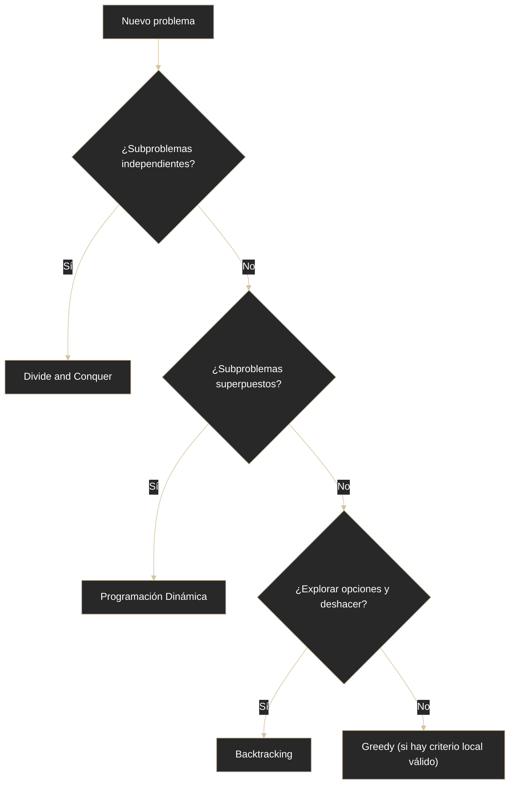

# Estrategias - Introducción

## Definición
Las estrategias de resolución son patrones para diseñar algoritmos según la estructura del problema.

## Explicación

- *Qué problema resuelve*
    Proporciona un marco conceptual para abordar diferentes tipos de problemas algorítmicos según sus características, permitiendo seleccionar el enfoque más adecuado
- *Cómo funciona por arriba*
    - No todos los problemas se resuelven igual; existen estrategias comunes que se aplican según la naturaleza del problema
    - Las estrategias son patrones de diseño algorítmico que los programadores usan todo el tiempo para resolver problemas reales
    - **Principales estrategias**:
        - Divide and Conquer: problemas que pueden dividirse recursivamente
        - Backtracking: problemas de exploración o combinatorios
        - Greedy: cuando se puede tomar decisiones óptimas locales
        - Programación Dinámica: cuando hay subproblemas repetidos con superposición
- *Qué implica / qué permite*
    Reconocer problemas similares y aplicar soluciones probadas; evitar reinventar la rueda; saber qué estrategia usar puede marcar la diferencia entre encontrar una solución rápidamente o quedarse atascado; identificarlas cuando aparezcan en problemas reales

## Diagrama (Mermaid)

## Comparaciones típicas
- vs [[03 - Algoritmos - Clasificación]]: estrategias de diseño algorítmico vs categorización general de algoritmos
- vs [[05 - Algoritmos - Clasificación por forma de operar]]: estrategias específicas de resolución vs clasificación amplia por mecanismo

## Palabras clave
- estrategia
- diseño algorítmico
- patrón
- selección de enfoque
- resolución de problemas

## Preguntas de examen
- ¿Por qué identificar el tipo de problema acelera el diseño de solución?
- ¿Qué señales orientan a Greedy, Backtracking o Programación Dinámica?

## Errores comunes
- Intentar resolver todo con una sola técnica conocida.
- Elegir estrategia sin validar precondiciones del problema.

## Mini-ejemplo (mental)
- Antes de construir, decidís si conviene martillo, destornillador o taladro; en algoritmos pasa igual.
